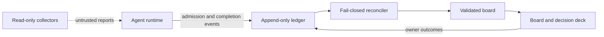

# HFLedger

HFLedger governs the interrupt channel between AI agents and a product owner.
The owner is not expected to evaluate code. Today answers three product
questions first: is production healthy, which product judgments are waiting,
and where work is flowing from idea to production. Ranked attention,
run-grouped changes, source health, and evidence dossiers remain available
under that owner-facing summary.

The owner can also shape active work without editing code or pretending to
control implementation status. Priorities provides a sectioned product overview,
a top-five **Urgent** section derived from the durable order, a separate
drag-and-drop ordering mode, concise owner headlines, intended outcomes, notes,
need-by dates, and active/parked choices. Existing work starts in deterministic, editable
product sections so a large queue is useful before manual cleanup.
Calendar brings those dates together with owner-decision deadlines, deferred
items returning for attention, and the next scheduled operations run.
Operations groups agent jobs and recurring work by the agent or local runner
responsible for them and can optionally show metadata-only Berd sessions as
working, waiting, stopped, or problematic. A job may expose one bounded latest
output and an exact related-task link without importing a conversation. Product
task headlines lead; model, harness, cadence, output references, source
references, and commands remain secondary detail.
An owner-only manual task has a separate **Mark
complete** action because the owner, not an agent, knows whether that action was
performed.

Most agent tools make it easy to start work inside one task. HFLedger provides
the missing product orientation across tasks and runtimes while retaining its
strict boundary for owner interruptions: when may an agent interrupt the
owner, which product judgment is required, and how does the outcome become
durable? It combines a
read-only Today browser, local JSON board, append-only evidence ledger, strict
admission and completion gates, a phone-sized Decision Deck, app-private local
triage state, and optional read-only collectors.

HFLedger is agent-agnostic. Any runtime that can read files and run a command can use the protocol. The reference implementation is Python standard library, local-first, and MIT licensed.

For large inherited queues, the owner can replace implementation-shaped task
wording with a concise headline, product outcome, reason it matters, and a
plain-language definition of done. Agent evidence and audit diagnostics remain
available as secondary detail without becoming the task explanation.
When one inherited task bundles several results, the owner can split it into
two to twelve product outcomes and mark each result complete independently.
Completion is an owner judgment overlay; it never rewrites observed execution
status or agent evidence.

## The contract

- An agent cannot file a vague escalation. Admission requires a reasoned
  recommendation, risk, reversibility, rollback, completed analysis, and a
  stable deduplication key; option-picking cards carry two or three prepared
  product choices.
- Every typed owner card is an `idea_pick`, `outcome_review`, `risk_card`,
  `stuck_alarm`, or `priority_review`, matching the owner's five judgment zones.
- Primary card copy uses plain product language. Diffs, pull requests, branch
  names, commits, and check names are secondary `footnoteLinks`, never the
  content the owner is asked to judge.
- A manual action must identify one exact owner-only step and observable completion proof.
- “I already did that” and “skip it” become provenance-bearing completion events instead of disappearing into chat history.
- Board mutation is locked, validated, backed up, and atomically replaced. Agent events are append-only and reconciled through a fail-closed cursor.
- Collected repository and file metadata is explicitly untrusted observation data. It grants no work, merge, or deployment authority.

This is not another agent runner or a general kanban board. The core product is the protocol governing the agent-to-human handoff.




The screenshot uses the repository's fictional bakery example; no real project data is included.

## Two-minute demo

Requirements: Python 3.9+ and Git on a POSIX system. Clone this repository, then:

```sh
cd hfledger
DEMO_HOME="$(mktemp -d)"
./scripts/ledger-demo "$DEMO_HOME"
./cli/ledger --home "$DEMO_HOME" serve
```

Open [http://127.0.0.1:7171/](http://127.0.0.1:7171/). The fictional bakery
Today view starts with production health, one waiting card of each kind, and
the idea-to-production flow. Calendar includes a dated product task and the
next fictional scheduled runs. Then open
[http://127.0.0.1:7171/deck](http://127.0.0.1:7171/deck) to review the five
product-owner cards. Any outcome is written only to the disposable directory
printed by `ledger-demo`.

The board is at [http://127.0.0.1:7171/](http://127.0.0.1:7171/). Stop the server with `Ctrl-C`. The committed `example/` remains untouched.

## Start a real workspace

```sh
./cli/ledger init ~/.ledger --project "My project"
./cli/ledger --home ~/.ledger validate
./cli/ledger --home ~/.ledger serve
```

Mutable state lives in the selected data directory, never in the public engine checkout:

```text
config.json       local policy, writers, UI, collectors, and pack settings
board.json        validated human/agent coordination state
ledger.jsonl      append-only events
owner-control.jsonl  append-only owner product direction and priority
locks/            process-coordination locks
backups/          retained board snapshots
reports/          private collector output
generated/        rendered instruction packs and inactive schedules
```

The first path is [`docs/quickstart.md`](docs/quickstart.md): file a real decision, reconcile it, open the deck, and capture completion. The complete data and event contract is [`docs/protocol.md`](docs/protocol.md).

## Native Mac app

The in-repository Mac host turns the same engine and canonical board into a
native desktop app. It adds explicit workspace management, a self-contained
runtime, process recovery, validated backups, notifications, a menu-bar item,
Launch at Login, explicit restrained Light and Dark appearances, and DMG/release
tooling while keeping all ledger traffic on loopback. The appearance choice is
app-private and applies to Today, the Decision Deck, Settings, onboarding, and
recovery together. See [`native/macos-host/README.md`](native/macos-host/README.md).

Public Developer ID signing and notarization are deliberately separate from
ordinary local builds. The Android companion remains a later phase; the Mac app
does not expose a remote listener.

## Agent integration

Agents use one CLI surface:

```text
ledger init
ledger ask decision|action
ledger ask card idea_pick|outcome_review|risk_card|stuck_alarm|priority_review
ledger done|skip
ledger event started|checkpoint|blocked|verified|shipped|abandoned
ledger validate
ledger reconcile
ledger serve
ledger collect
ledger owner-control
ledger operations
ledger render-packs
```

`ledger ask` is intentionally demanding. Agent-executable work stays in the
queue; raw ideas stay in the inbox; only an irreducible product judgment or
exact owner-only action should pass admission. Typed cards translate that
judgment into the five zones above. See [`docs/owner-model.md`](docs/owner-model.md)
and [`docs/discipline.md`](docs/discipline.md).

`ledger event` is the low-friction evidence surface for Codex, Claude Code, and
other runtimes. It records bounded task progress and evidence references
without granting the writer permission to change board state. A shipped event
requires at least one evidence reference; a `built` event alone never counts as
shipped.

The Codex, generic, and Claude Code instruction adapters inject the same policy
and runtime-labeled evidence commands into their respective layouts. The
optional GitHub collector reads PR, CI, issue, and branch-comparison facts
through an authenticated `gh` CLI. The local-files collector records metadata
without reading contents. An optional Berd adapter reads bounded session
metadata through `berdctl` with `--messages 0`; it never retains conversation
titles, paths, projects, message counts, or messages. Details and inactive launchd/systemd schedule
generation are in [`docs/automation.md`](docs/automation.md).

## Reference interface

The standard-library HTTP service provides:

- a Today view led by one plain production-health sentence, waiting card counts
  across the five judgment zones, and product flow from idea pick through
  production;
- capped ranked attention, changes grouped by an exact run, and quiet concerns
  only when the required sources were actually observed;
- Changes, All Work, Shipped Log, Watched, Projects, and an evidence inspector
  with explicit provenance and separate item-change/source-observation clocks;
- Priorities with a calm sectioned overview, a separate exact-order drag mode,
  whole-row Details selection, owner headlines, outcomes, need-by dates, and
  active/parked planning state that agents can read through the CLI;
- a product-shaped **Start work** handoff that copies an agent-ready prompt in
  every client and, in the Mac app, can open a blank local Codex or Claude Code
  CLI session without automatically submitting observed text;
- Calendar with a familiar month grid and agenda for task need-by dates,
  decision deadlines, deferred-item returns, and next scheduled runs;
- Operations with product-led live session state plus agent jobs and recurring
  work grouped across agents and local automation, including runner, model when
  known, cadence, next run, product purpose, bounded latest output, exact
  related work, and explicit health, stale, and unconfigured states;
- a global **Refresh now** control that scans every configured read-only source
  in the selected workspace, reconciles pending events when the workspace is
  writable, and reloads the validated owner view with one plain-language result;
- a responsive board for queue, inbox, owner tasks, admitted asks, and outcomes;
- a mobile decision deck with option selection, recommendation acceptance, snooze, need-more-info, completion, skip, and digest-bound undo where safe;
- bounded deterministic Command-K search over projected metadata plus
  navigation-only installed-app `hfledger://item/<workspace-id>/<item-id>` links;
- config-driven branding and allowlisted independent contexts.

Today can acknowledge, snooze, watch, and mark changes seen only in private
presentation state. It can also record a one-way owner report that an exact
owner-only manual task was completed. It never answers a decision, completes
agent work, edits the observed board, appends implementation evidence, changes
collector configuration, merges, or deploys. Separately, Priorities writes only
the append-only owner-control lane; it never rewrites the observed board or
event ledger. Those other actions remain in the Decision Deck or the named
authoritative source.
**Refresh now** uses only the existing fail-closed reconciler and configured
read-only collectors. It does not discover folders, enable integrations, pull
code, run agent work, or follow links found in observed data.
See [`docs/ui.md`](docs/ui.md) for the nine one-home states, evidence vocabulary,
coverage model, keyboard/menu behavior, and first-run/degraded limitations.

The native Mac app can continuously check one explicit HTTPS production-health
address per workspace. The address stays in mode-`0600` app-private settings;
the engine retains no response body and overlays only a plain healthy/degraded
observation onto Today. A single missed check remains a quiet retry. Three
consecutive failures degrade production, while one successful check recovers.
The monitor runs while HFLedger is running, including when its windows are
closed; Launch at Login keeps that process available after sign-in.
See [`docs/production-monitoring.md`](docs/production-monitoring.md) for the
state machine, privacy boundary, and lifecycle.

It binds only to `127.0.0.1`, rejects non-loopback Host headers, has no CORS opt-in, and is not an authenticated remote service. Do not put an unauthenticated proxy in front of it. See [`docs/ui.md`](docs/ui.md).

Observer workspaces can set `ui.readOnly: true`; the service then exposes the
same validated views while refusing authoritative mutation requests with `403`.
Private seen, acknowledgement, snooze, watch, navigation, and pane state remain
presentation-only. Owner product direction remains writable in its separate
control lane, including one-way completion reports for owner-only manual tasks.
Both leave `board.json` and `ledger.jsonl` byte-identical. See
[`docs/owner-control.md`](docs/owner-control.md).

## Current limits

- POSIX `fcntl` locking; native Windows writers are unsupported.
- The CLI is clone-based; the Mac app is source-buildable but has no notarized public release yet.
- The reference UI is loopback-only.
- Browser-only serving keeps triage state for the current process only; durable
  state across process restarts requires the native Mac host.
- GitHub collection requires a separately installed and authenticated `gh` CLI.
- Collectors are explicit and off by default. Disabled or never-observed
  sources are shown as unobserved, never as quiet or all clear.
- HFLedger observes sessions, commands, and schedules but does not control
  agents or execute, install, enable, or repair commands from Operations.
- Production writes are unsupported by the automation policy.
- Transition notifications, a rich menu-bar popover, Quick Look, analytics,
  advanced disputes, and multi-machine skew remain deferred.

The CLI command remains `ledger`, which can collide with the ledger-cli accounting program. If both are installed, use an alias such as `alias hfledger=/path/to/hfledger/cli/ledger`.

## Development and release checks

```sh
python3 tests/run_all.py
./scripts/release-check --allow-dirty
```

The release check compiles the code, validates local documentation links, runs the full suite, validates the fictional example, and simulates the demo's first swipe. Maintainers can supply the deliberately external privacy gate with `LEDGER_PUBLISH_GATE=/path/to/publish-gate.sh`.

Contributions are described in [`CONTRIBUTING.md`](CONTRIBUTING.md). Please report vulnerabilities using [`SECURITY.md`](SECURITY.md). Release history is in [`CHANGELOG.md`](CHANGELOG.md).

MIT License. Copyright HFLedger contributors.
