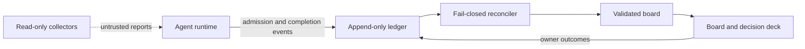

# HFLedger

HFLedger rate-limits and audits the interrupt channel between AI agents and the person running them.

Most agent tools make it easy to start work. HFLedger focuses on the opposite boundary: when may an agent interrupt a human, what must it provide, and how does a reported outcome become durable? It combines a local JSON board, an append-only event ledger, strict admission and completion gates, a phone-sized decision deck, and optional read-only collectors.

HFLedger is agent-agnostic. Any runtime that can read files and run a command can use the protocol. The reference implementation is Python standard library, local-first, and MIT licensed.

## The contract

- An agent cannot file a vague escalation. A decision needs two or three options, a reasoned recommendation, risk, reversibility, rollback, completed analysis, and a stable deduplication key.
- A manual action must identify one exact owner-only step and observable completion proof.
- “I already did that” and “skip it” become provenance-bearing completion events instead of disappearing into chat history.
- Board mutation is locked, validated, backed up, and atomically replaced. Agent events are append-only and reconciled through a fail-closed cursor.
- Collected repository and file metadata is explicitly untrusted observation data. It grants no work, merge, or deployment authority.

This is not another agent runner or a general kanban board. The core product is the protocol governing the agent-to-human handoff.




The screenshot uses the repository's fictional bakery example; no real project data is included.

## Two-minute demo

Requirements: Python 3.9+ and Git on a POSIX system. Clone this repository, then:

```sh
cd hfledger
DEMO_HOME="$(mktemp -d)"
./scripts/ledger-demo "$DEMO_HOME"
./cli/ledger --home "$DEMO_HOME" serve
```

Open [http://127.0.0.1:7171/deck](http://127.0.0.1:7171/deck). The copied fictional bakery workspace contains one admitted decision. Choose an option or swipe right to accept the recommendation; the outcome is written only to the disposable directory printed by `ledger-demo`.

The board is at [http://127.0.0.1:7171/](http://127.0.0.1:7171/). Stop the server with `Ctrl-C`. The committed `example/` remains untouched.

## Start a real workspace

```sh
./cli/ledger init ~/.ledger --project "My project"
./cli/ledger --home ~/.ledger validate
./cli/ledger --home ~/.ledger serve
```

Mutable state lives in the selected data directory, never in the public engine checkout:

```text
config.json       local policy, writers, UI, collectors, and pack settings
board.json        validated human/agent coordination state
ledger.jsonl      append-only events
locks/            process-coordination locks
backups/          retained board snapshots
reports/          private collector output
generated/        rendered instruction packs and inactive schedules
```

The first path is [`docs/quickstart.md`](docs/quickstart.md): file a real decision, reconcile it, open the deck, and capture completion. The complete data and event contract is [`docs/protocol.md`](docs/protocol.md).

## Agent integration

Agents use one CLI surface:

```text
ledger init
ledger ask decision|action
ledger done|skip
ledger validate
ledger reconcile
ledger serve
ledger collect
ledger render-packs
```

`ledger ask` is intentionally demanding. Agent-executable work stays in the queue; raw ideas stay in the inbox; only an irreducible human choice or exact owner-only action should pass admission. See [`docs/discipline.md`](docs/discipline.md).

The generic and Claude Code instruction adapters inject the same policy into runtime-specific layouts. The optional GitHub collector reads PR, CI, issue, and branch-comparison facts through an authenticated `gh` CLI. The local-files collector records metadata without reading contents. Details and inactive launchd/systemd schedule generation are in [`docs/automation.md`](docs/automation.md).

## Reference interface

The standard-library HTTP service provides:

- a responsive board for queue, inbox, owner tasks, admitted asks, and outcomes;
- a mobile decision deck with option selection, recommendation acceptance, snooze, need-more-info, completion, skip, and digest-bound undo where safe;
- config-driven branding and allowlisted independent contexts.

It binds only to `127.0.0.1`, rejects non-loopback Host headers, has no CORS opt-in, and is not an authenticated remote service. Do not put an unauthenticated proxy in front of it. See [`docs/ui.md`](docs/ui.md).

## Current limits

- POSIX `fcntl` locking; native Windows writers are unsupported.
- Clone-based execution; there is no package-manager release yet.
- The reference UI is loopback-only.
- GitHub collection requires a separately installed and authenticated `gh` CLI.
- Schedules are generated for inspection but never installed or activated automatically.
- Production writes are unsupported by the automation policy.

The CLI command remains `ledger`, which can collide with the ledger-cli accounting program. If both are installed, use an alias such as `alias hfledger=/path/to/hfledger/cli/ledger`.

## Development and release checks

```sh
python3 tests/run_all.py
./scripts/release-check --allow-dirty
```

The release check compiles the code, validates local documentation links, runs the full suite, validates the fictional example, and simulates the demo's first swipe. Maintainers can supply the deliberately external privacy gate with `LEDGER_PUBLISH_GATE=/path/to/publish-gate.sh`.

Contributions are described in [`CONTRIBUTING.md`](CONTRIBUTING.md). Please report vulnerabilities using [`SECURITY.md`](SECURITY.md). Release history is in [`CHANGELOG.md`](CHANGELOG.md).

MIT License. Copyright HFLedger contributors.
