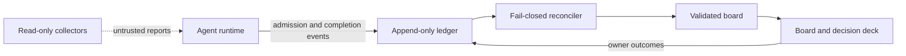
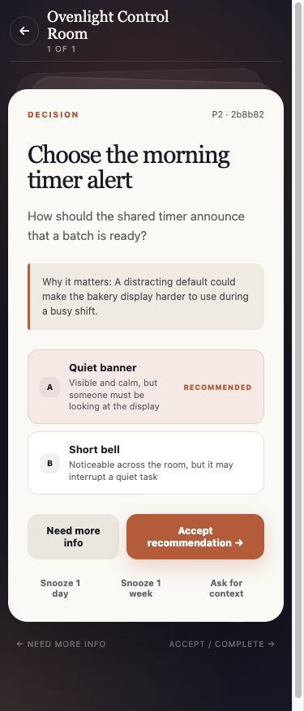

# HFLedger

HFLedger is a quiet local ledger browser for work spread across AI coding
agents. It answers two questions first: what needs attention now, and what
changed since the last successful visit. Ranked attention, run-grouped changes,
source health, and evidence dossiers replace a metric dashboard or a second
task database.

Most agent tools make it easy to start work inside one task. HFLedger provides
the missing orientation across tasks and runtimes while retaining its strict
boundary for human interruptions: when may an agent interrupt a person, what
must it provide, and how does a reported outcome become durable? It combines a
read-only Today browser, local JSON board, append-only evidence ledger, strict
admission and completion gates, a phone-sized Decision Deck, app-private local
triage state, and optional read-only collectors.

HFLedger is agent-agnostic. Any runtime that can read files and run a command can use the protocol. The reference implementation is Python standard library, local-first, and MIT licensed.

## The contract

- An agent cannot file a vague escalation. A decision needs two or three options, a reasoned recommendation, risk, reversibility, rollback, completed analysis, and a stable deduplication key.
- A manual action must identify one exact owner-only step and observable completion proof.
- “I already did that” and “skip it” become provenance-bearing completion events instead of disappearing into chat history.
- Board mutation is locked, validated, backed up, and atomically replaced. Agent events are append-only and reconciled through a fail-closed cursor.
- Collected repository and file metadata is explicitly untrusted observation data. It grants no work, merge, or deployment authority.

This is not another agent runner or a general kanban board. The core product is the protocol governing the agent-to-human handoff.





The screenshot uses the repository's fictional bakery example; no real project data is included.

## Two-minute demo

Requirements: Python 3.9+ and Git on a POSIX system. Clone this repository, then:

```sh
cd hfledger
DEMO_HOME="$(mktemp -d)"
./scripts/ledger-demo "$DEMO_HOME"
./cli/ledger --home "$DEMO_HOME" serve
```

Open [http://127.0.0.1:7171/deck](http://127.0.0.1:7171/deck). The copied fictional bakery workspace contains one admitted decision. Choose an option or swipe right to accept the recommendation; the outcome is written only to the disposable directory printed by `ledger-demo`.

The board is at [http://127.0.0.1:7171/](http://127.0.0.1:7171/). Stop the server with `Ctrl-C`. The committed `example/` remains untouched.

## Start a real workspace

```sh
./cli/ledger init ~/.ledger --project "My project"
./cli/ledger --home ~/.ledger validate
./cli/ledger --home ~/.ledger serve
```

Mutable state lives in the selected data directory, never in the public engine checkout:

```text
config.json       local policy, writers, UI, collectors, and pack settings
board.json        validated human/agent coordination state
ledger.jsonl      append-only events
locks/            process-coordination locks
backups/          retained board snapshots
reports/          private collector output
generated/        rendered instruction packs and inactive schedules
```

The first path is [`docs/quickstart.md`](docs/quickstart.md): file a real decision, reconcile it, open the deck, and capture completion. The complete data and event contract is [`docs/protocol.md`](docs/protocol.md).

## Native Mac app

The in-repository Mac host turns the same engine and canonical board into a
native desktop app. It adds explicit workspace management, a self-contained
runtime, process recovery, validated backups, notifications, a menu-bar item,
Launch at Login, and DMG/release tooling while keeping all ledger traffic on
loopback. See [`native/macos-host/README.md`](native/macos-host/README.md).

Public Developer ID signing and notarization are deliberately separate from
ordinary local builds. The Android companion remains a later phase; the Mac app
does not expose a remote listener.

## Agent integration

Agents use one CLI surface:

```text
ledger init
ledger ask decision|action
ledger done|skip
ledger event started|checkpoint|blocked|verified|shipped|abandoned
ledger validate
ledger reconcile
ledger serve
ledger collect
ledger render-packs
```

`ledger ask` is intentionally demanding. Agent-executable work stays in the queue; raw ideas stay in the inbox; only an irreducible human choice or exact owner-only action should pass admission. See [`docs/discipline.md`](docs/discipline.md).

`ledger event` is the low-friction evidence surface for Codex, Claude Code, and
other runtimes. It records bounded task progress and evidence references
without granting the writer permission to change board state. A shipped event
requires at least one evidence reference; a `built` event alone never counts as
shipped.

The Codex, generic, and Claude Code instruction adapters inject the same policy
and runtime-labeled evidence commands into their respective layouts. The
optional GitHub collector reads PR, CI, issue, and branch-comparison facts
through an authenticated `gh` CLI. The local-files collector records metadata
without reading contents. Details and inactive launchd/systemd schedule
generation are in [`docs/automation.md`](docs/automation.md).

## Reference interface

The standard-library HTTP service provides:

- a Today view with capped ranked attention, changes grouped by an exact run,
  and quiet concerns only when the required sources were actually observed;
- Changes, All Work, Shipped Log, Watched, Projects, and an evidence inspector
  with explicit provenance and separate item-change/source-observation clocks;
- a responsive board for queue, inbox, owner tasks, admitted asks, and outcomes;
- a mobile decision deck with option selection, recommendation acceptance, snooze, need-more-info, completion, skip, and digest-bound undo where safe;
- bounded deterministic Command-K search over projected metadata plus
  navigation-only installed-app `hfledger://item/<workspace-id>/<item-id>` links;
- config-driven branding and allowlisted independent contexts.

Today can acknowledge, snooze, watch, and mark changes seen only in private
presentation state. It never answers a decision, completes work, edits the
board, appends evidence, changes collector configuration, merges, or deploys.
Those actions remain in the Decision Deck or the named authoritative source.
See [`docs/ui.md`](docs/ui.md) for the nine one-home states, evidence vocabulary,
coverage model, keyboard/menu behavior, and first-run/degraded limitations.

It binds only to `127.0.0.1`, rejects non-loopback Host headers, has no CORS opt-in, and is not an authenticated remote service. Do not put an unauthenticated proxy in front of it. See [`docs/ui.md`](docs/ui.md).

Observer workspaces can set `ui.readOnly: true`; the service then exposes the
same validated views while refusing authoritative mutation requests with `403`.
Private seen, acknowledgement, snooze, watch, navigation, and pane state remain
presentation-only and leave `board.json` and `ledger.jsonl` byte-identical.

## Current limits

- POSIX `fcntl` locking; native Windows writers are unsupported.
- The CLI is clone-based; the Mac app is source-buildable but has no notarized public release yet.
- The reference UI is loopback-only.
- Browser-only serving keeps triage state for the current process only; durable
  state across process restarts requires the native Mac host.
- GitHub collection requires a separately installed and authenticated `gh` CLI.
- Collectors are explicit and off by default. Disabled or never-observed
  sources are shown as unobserved, never as quiet or all clear.
- Schedules are generated for inspection but never installed or activated automatically.
- Production writes are unsupported by the automation policy.
- Transition notifications, a rich menu-bar popover, Quick Look, analytics,
  advanced disputes, and multi-machine skew remain deferred.

The CLI command remains `ledger`, which can collide with the ledger-cli accounting program. If both are installed, use an alias such as `alias hfledger=/path/to/hfledger/cli/ledger`.

## Development and release checks

```sh
python3 tests/run_all.py
./scripts/release-check --allow-dirty
```

The release check compiles the code, validates local documentation links, runs the full suite, validates the fictional example, and simulates the demo's first swipe. Maintainers can supply the deliberately external privacy gate with `LEDGER_PUBLISH_GATE=/path/to/publish-gate.sh`.

Contributions are described in [`CONTRIBUTING.md`](CONTRIBUTING.md). Please report vulnerabilities using [`SECURITY.md`](SECURITY.md). Release history is in [`CHANGELOG.md`](CHANGELOG.md).

MIT License. Copyright HFLedger contributors.
