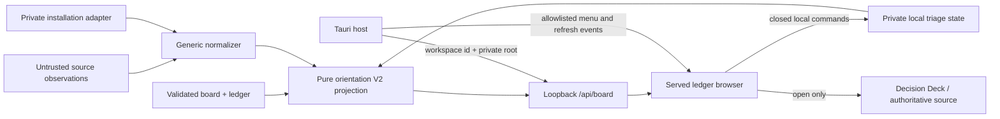
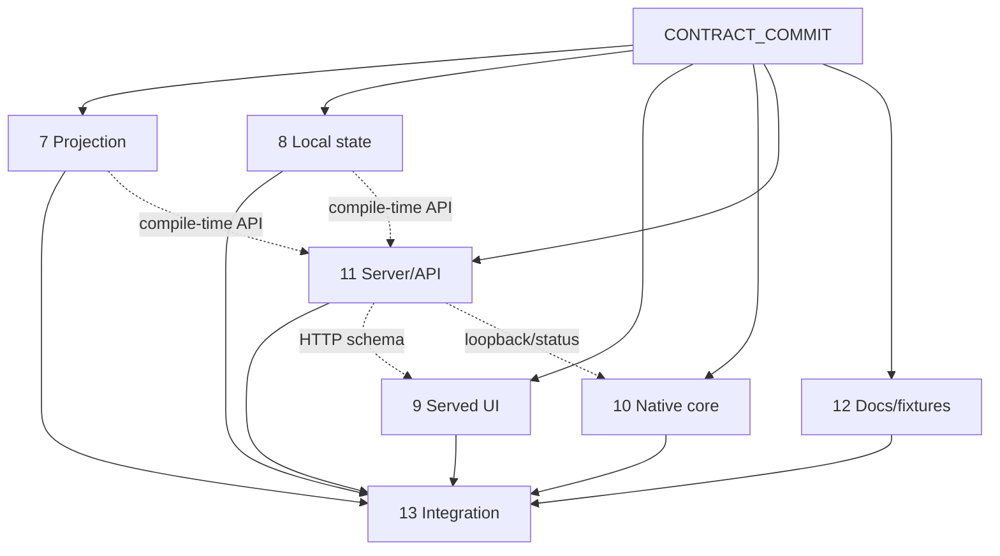

# HFLedger redesign v2 — canonical implementation contract

Date: July 18, 2026

Status: locked Wave 1.5 contract

Base commit: `ca27e60a9bff1f15c4f553edae707df37c47b497`

Wave 1 inputs:

- projection contract: `3cfb793`
- interaction contract: `6dc1652`
- local-state contract: `faf7333`
- coverage contract: `4f6eb61`
- QA contract: `2676ed0`

This is the normative contract for Prompts 7–13. When a Wave 1 document uses
different names or semantics, this document wins. The sibling documents remain
the detailed rationale and test inventory for their domains; they are not
independent implementation choices after this commit.

## 1. Product job and boundaries

HFLedger is a quiet Mac ledger browser for work spread across agent runtimes.
Its primary check-in loop is:

> What changed since I last looked, and what needs me now?

It ranks the small set of work with an explicit cost of being ignored, groups
new changes by the run that produced them, and makes every status inspectable
through evidence, source health, and two separate clocks. It is not a metrics
dashboard, a second task database, an agent runner, or another chat surface.

The following boundaries are invariant:

1. `board.json` and `ledger.jsonl` remain the authoritative coordination and
   event planes.
2. The Today interface is read-only with respect to tasks, decisions, asks,
   queue state, collector configuration, merges, deployments, and evidence.
3. Today may change only app-private presentation state: seen, acknowledged,
   snoozed, watched, current view and selection, pane widths, and disclosure.
4. The existing Decision Deck remains the only HFLedger surface that answers
   an owner decision or records completion/skip. Today may open it but may not
   reproduce its controls or routes.
5. The public engine remains installation-generic. Project-specific board
   sections, paths, run names, repositories, and source mappings belong in a
   private adapter that emits the generic records defined here.
6. Collector and adapter output is bounded, read-only, untrusted observation
   data. It grants no work, merge, deploy, send, or configuration authority.
7. Deterministic rules and exact typed identities are required. Model calls,
   fuzzy title matching, semantic similarity, numeric confidence, and hidden
   scores are forbidden.

## 2. Canonical resolutions of Wave 1 differences

The synthesis resolves the important differences as follows:

| Question | Canonical resolution |
| --- | --- |
| Coverage naming | Screen coverage is `complete`, `partial`, or `invalid`. Source health is the seven-state `disabled`, `never-observed`, `unavailable`, `degraded`, `stale`, `idle`, or `healthy` model. There is no competing top-level `healthy/partial/broken/unobserved` status. |
| Item coverage naming | Per-item coverage is `complete`, `partial`, or `unobserved`. `covered` is not a legal value. |
| Primary homes | The exact order is `needs-you`, `disputed`, `silent-while-observed`, `shipped-unverified`, `in-motion`, `queued`, `shipped-verified`, `parked`, `unobserved`. `queued` is distinct; `parked` and `unobserved` are not one combined home. |
| Public run kinds | Public kinds are generic: `adapter-run`, `agent-session`, `collector`, `reconcile`, `owner-session`, and `other`. A private adapter may supply a display label such as “Sweep” or “Grind”; those names do not enter the public enum or protocol requirements. |
| Projection/local identifiers | Public JSON uses `itemId` and `changeId`. The private state file uses those same values and spellings. Earlier `itemKey` and `changeKey` names are superseded. `attentionKey` remains a separate material-generation key. |
| Seen cursor | The server stores only an opaque, projection-issued `viewCursor`. Clients never construct a timestamp cursor. Exact `changeId` records supplement the cursor for individually seen changes. |
| Attention totals | `eligibleTotal` is the classified total before local triage. `total` is the locally visible total after acknowledgement and active snooze filters and before the cap. `items` is the first `cap` visible rows. Sidebar and Dock badges use `attention.total`. |
| Local persistence boundary | Durable state is one closed JSON file per registered workspace under the native app's Application Support directory, accessed through the same-origin loopback server. The external board window receives no general Tauri IPC or filesystem capability. |
| Native menu bridge | Native-to-page commands use only an allowlisted one-way command event. Page-to-native state travels through the closed loopback API; no arbitrary invoke or path bridge is added. |
| Browser-only behavior | The same local-state API uses a process-memory backend and is labeled `session`. It creates no conventional state file and does not claim cross-process persistence. |
| “Quiet” wording | `quiet` is reserved for `silent-while-observed`. Parked and unobserved work may be linked from the library footer but must never be described as quiet. |

## 3. Architecture and versioning



The existing orientation V1 response remains unchanged during migration.
`GET /api/board` returns both:

- `orientation`: the current version-1 object; and
- `orientationV2`: the version-2 object defined here.

V2 is built from validated raw inputs, not translated from V1's overlapping
lanes. Removing or reinterpreting V1 requires a later protocol version.

The exact core entry point is:

```python
build_v2(
    validated_board,
    validated_ledger_entries,
    validated_config,
    now_utc,
    normalized_adapter_bundle=None,
    local_view_state=None,
    collector_report=None,
)
```

`now_utc` is required and timezone-aware. Equal canonical inputs and equal
`now_utc` produce byte-equivalent canonical JSON. The builder performs no
network request, filesystem discovery, mutable global update, or wall-clock
read.

The optional adapter bundle is closed-schema generic data:

```json
{
  "schemaVersion": 1,
  "adapterId": "fictional-installation-adapter",
  "sources": [],
  "items": [],
  "runs": [],
  "changes": [],
  "evidence": [],
  "links": [],
  "diagnostics": []
}
```

It may associate records only through exact stable ids, exact typed ledger task
ids, exact `blocks` ids, or an explicit exact-reference map. Private section
names and legacy prose parsing remain outside the public engine.

## 4. Versioned projection schema

### 4.1 Top-level response

Every field below is present. Missing facts use `null`, an empty array, or an
explicit epistemic/coverage state rather than conditional omission.

```json
{
  "version": 2,
  "generatedAt": "2026-07-18T18:00:00Z",
  "asOf": "2026-07-18T17:58:00Z",
  "projectionId": "projection-5de72e00c1bf3835be7d3e2d",
  "visit": {
    "mode": "since-visit",
    "lastSuccessfulVisitAt": "2026-07-18T15:00:00Z",
    "inputCursor": "ov2:eyJ2IjoyLCJvIjoiMjAyNi0wNy0xOFQxNTowMDowMFoiLCJpIjoiY2hhbmdlLWFiYyJ9:31e4a8b4",
    "cursorValid": true,
    "cursorReason": "valid"
  },
  "nextCursor": "ov2:eyJ2IjoyLCJvIjoiMjAyNi0wNy0xOFQxNzowMDowMFoiLCJpIjoiY2hhbmdlLWRlZiJ9:bf29ac76",
  "attention": {
    "items": [
      {
        "itemId": "item-cd987b1a230346dc7aee0cc8",
        "attentionKey": "attention-f1cc4ba276a5729c4f9ea44a",
        "primaryHome": "needs-you",
        "rankReason": "Open P1 owner decision blocks the next attended run.",
        "rankBands": ["home:needs-you", "deadline:none", "priority:p1", "impact:high", "age:older"]
      }
    ],
    "eligibleTotal": 1,
    "total": 1,
    "acknowledgedTotal": 0,
    "snoozedTotal": 0,
    "cap": 7,
    "truncated": false
  },
  "changes": {
    "mode": "since-visit",
    "since": "2026-07-18T15:00:00Z",
    "through": "2026-07-18T17:00:00Z",
    "groups": [
      {
        "runId": "run-4367ec8190200fc58fca2b8e",
        "label": "Overnight agent session",
        "kind": "agent-session",
        "completedAt": "2026-07-18T17:00:00Z",
        "provenance": "agent-reported",
        "changeRefs": ["change-d22c6b2c72faf327ae3d4a14"],
        "totalChanges": 1,
        "unseenChanges": 1,
        "perGroupCap": 25,
        "truncated": false
      }
    ],
    "totalGroups": 1,
    "totalChanges": 1,
    "unseenTotal": 1,
    "groupCap": 12,
    "perGroupCap": 25,
    "truncated": false
  },
  "quietConcerns": {
    "items": [],
    "total": 0,
    "cap": 3,
    "truncated": false
  },
  "library": {
    "counts": {
      "all-work": 1,
      "needs-you": 1,
      "disputed": 0,
      "silent-while-observed": 0,
      "shipped-unverified": 0,
      "in-motion": 0,
      "queued": 0,
      "shipped-verified": 0,
      "parked": 0,
      "unobserved": 0,
      "watched": 1
    },
    "smartLists": [
      {
        "id": "all-work",
        "label": "All Work",
        "count": 1,
        "itemRefs": ["item-cd987b1a230346dc7aee0cc8"],
        "refCap": 200,
        "truncated": false
      },
      {
        "id": "needs-you",
        "label": "Needs You",
        "count": 1,
        "itemRefs": ["item-cd987b1a230346dc7aee0cc8"],
        "refCap": 200,
        "truncated": false
      },
      {
        "id": "disputed",
        "label": "Disputed",
        "count": 0,
        "itemRefs": [],
        "refCap": 200,
        "truncated": false
      },
      {
        "id": "silent-while-observed",
        "label": "Silent While Observed",
        "count": 0,
        "itemRefs": [],
        "refCap": 200,
        "truncated": false
      },
      {
        "id": "shipped-unverified",
        "label": "Shipped, Not Verified",
        "count": 0,
        "itemRefs": [],
        "refCap": 200,
        "truncated": false
      },
      {
        "id": "in-motion",
        "label": "In Motion",
        "count": 0,
        "itemRefs": [],
        "refCap": 200,
        "truncated": false
      },
      {
        "id": "queued",
        "label": "Queued",
        "count": 0,
        "itemRefs": [],
        "refCap": 200,
        "truncated": false
      },
      {
        "id": "shipped-verified",
        "label": "Shipped, Verified",
        "count": 0,
        "itemRefs": [],
        "refCap": 200,
        "truncated": false
      },
      {
        "id": "parked",
        "label": "Parked",
        "count": 0,
        "itemRefs": [],
        "refCap": 200,
        "truncated": false
      },
      {
        "id": "unobserved",
        "label": "Unobserved",
        "count": 0,
        "itemRefs": [],
        "refCap": 200,
        "truncated": false
      },
      {
        "id": "watched",
        "label": "Watched",
        "count": 1,
        "itemRefs": ["item-cd987b1a230346dc7aee0cc8"],
        "refCap": 200,
        "truncated": false
      }
    ]
  },
  "items": [
    {
      "id": "item-cd987b1a230346dc7aee0cc8",
      "sourceId": "board:main",
      "sourceItemRef": "decision:ovenlight:release-gate",
      "entityKind": "decision",
      "title": "Choose the fictional release window",
      "project": "Ovenlight",
      "statusLabel": "Open",
      "primaryHome": "needs-you",
      "secondaryFlags": ["watched"],
      "whyHere": "The admitted owner decision blocks the next attended run.",
      "homeSince": "2026-07-18T14:00:00Z",
      "priority": "P1",
      "deadline": null,
      "provenance": "verified",
      "attentionKey": "attention-f1cc4ba276a5729c4f9ea44a",
      "clocks": {
        "itemChangedAt": "2026-07-18T14:00:00Z",
        "relevantSourcesObservedAt": "2026-07-18T17:55:00Z",
        "observationBasis": "all-required-minimum"
      },
      "coverage": {
        "state": "complete",
        "asOf": "2026-07-18T17:55:00Z",
        "relevantSources": [
          {
            "sourceId": "board:main",
            "requirement": "required",
            "reasonCode": "authoritative-status",
            "scopes": ["decisions"]
          }
        ],
        "namedAbsences": []
      },
      "nextAction": {
        "kind": "open-decision",
        "label": "Open Decision Deck",
        "reason": "The answer belongs in the authoritative decision surface.",
        "linkId": "link-8d52f4fd78aa8a9017b2f972",
        "authoritative": true
      },
      "evidenceIds": ["evidence-47c6b6102a4291f075df2cf0"],
      "changeIds": ["change-d22c6b2c72faf327ae3d4a14"],
      "linkIds": ["link-8d52f4fd78aa8a9017b2f972"],
      "copyContext": {
        "version": 1,
        "text": "HFLedger context\nItem: Choose the fictional release window\nWhy here: The admitted owner decision blocks the next attended run.\nNext action: Open Decision Deck",
        "truncated": false
      }
    }
  ],
  "runs": [
    {
      "id": "run-4367ec8190200fc58fca2b8e",
      "sourceId": "ledger:main",
      "sourceRunRef": "session:ovenlight:0718",
      "kind": "agent-session",
      "label": "Overnight agent session",
      "startedAt": "2026-07-18T16:30:00Z",
      "completedAt": "2026-07-18T17:00:00Z",
      "status": "completed",
      "provenance": "agent-reported",
      "changeIds": ["change-d22c6b2c72faf327ae3d4a14"],
      "linkIds": [],
      "timestampEstimated": false
    }
  ],
  "changesById": [
    {
      "id": "change-d22c6b2c72faf327ae3d4a14",
      "runId": "run-4367ec8190200fc58fca2b8e",
      "itemId": "item-cd987b1a230346dc7aee0cc8",
      "kind": "decision-opened",
      "summary": "An admitted release decision opened.",
      "itemChangedAt": "2026-07-18T14:00:00Z",
      "timestampEstimated": false,
      "provenance": "verified",
      "evidenceIds": ["evidence-47c6b6102a4291f075df2cf0"],
      "linkIds": ["link-8d52f4fd78aa8a9017b2f972"],
      "seen": false
    }
  ],
  "evidence": [
    {
      "id": "evidence-47c6b6102a4291f075df2cf0",
      "itemId": "item-cd987b1a230346dc7aee0cc8",
      "claim": "The authoritative board records this decision as open.",
      "kind": "status",
      "sourceId": "board:main",
      "sourceRef": "decision:ovenlight:release-gate",
      "observedAt": "2026-07-18T17:55:00Z",
      "itemChangedAt": "2026-07-18T14:00:00Z",
      "timestampEstimated": false,
      "provenance": "verified",
      "runId": null,
      "linkId": "link-8d52f4fd78aa8a9017b2f972",
      "supportsEvidenceIds": [],
      "contradictsEvidenceIds": []
    }
  ],
  "links": [
    {
      "id": "link-8d52f4fd78aa8a9017b2f972",
      "kind": "board-item",
      "label": "Open Decision Deck",
      "target": "/deck?context=main",
      "sourceId": "board:main",
      "authoritative": true,
      "copyable": true
    }
  ],
  "coverage": {
    "version": 2,
    "evaluatedAt": "2026-07-18T18:00:00Z",
    "screen": {
      "state": "complete",
      "asOf": "2026-07-18T17:55:00Z",
      "reasonCodes": [],
      "metaAlertId": null,
      "qualification": "All required sources were observed through 5:55 PM."
    },
    "observer": {
      "state": "healthy",
      "lastAttemptAt": "2026-07-18T18:00:00Z",
      "lastSuccessfulObservationAt": "2026-07-18T18:00:00Z",
      "freshUntil": "2026-07-18T18:05:00Z",
      "reasonCodes": []
    },
    "sources": [
      {
        "id": "board:main",
        "kind": "board",
        "label": "Board",
        "state": "healthy",
        "configured": true,
        "requiredForScreen": true,
        "lastAttemptAt": "2026-07-18T17:55:00Z",
        "lastSuccessfulObservationAt": "2026-07-18T17:55:00Z",
        "newestObservedChangeAt": "2026-07-18T14:00:00Z",
        "freshUntil": "2026-07-18T18:05:00Z",
        "staleAfterSeconds": 600,
        "observationCount": 2,
        "scopeHealth": [
          {
            "id": "decisions",
            "state": "healthy",
            "lastSuccessfulObservationAt": "2026-07-18T17:55:00Z",
            "freshUntil": "2026-07-18T18:05:00Z",
            "reasonCodes": []
          }
        ],
        "reasonCodes": [],
        "dataClassification": "authoritative-read",
        "grantsAuthority": false,
        "recoveredAt": null
      }
    ],
    "metaAlerts": [],
    "diagnostics": []
  },
  "totals": {
    "items": 1,
    "attentionEligible": 1,
    "attentionVisible": 1,
    "changes": 1,
    "runs": 1,
    "evidence": 1,
    "quietConcerns": 0,
    "byHome": {
      "needs-you": 1,
      "disputed": 0,
      "silent-while-observed": 0,
      "shipped-unverified": 0,
      "in-motion": 0,
      "queued": 0,
      "shipped-verified": 0,
      "parked": 0,
      "unobserved": 0
    }
  },
  "compatibility": {
    "orientationV1AlsoServed": true,
    "derivedFromV1": false
  }
}
```

The example is fictional. Implementations emit all eleven smart lists in the
shown order, all normalized items, and every source required by current input.

`asOf` is the validated board's authoritative update timestamp.
`generatedAt` is the injected evaluation instant. `coverage.screen.asOf` is the
oldest qualified source-success time supporting the screen. These values are
independent. `projectionId` is `projection-` plus the first 24 hexadecimal
characters of SHA-256 over canonical projection version, board cursor/digest,
board update timestamp, adapter digest, collector digest, local cursor, and
`now_utc`.

`library.smartLists` always contains `all-work`, `needs-you`, `disputed`,
`silent-while-observed`, `shipped-unverified`, `in-motion`, `queued`,
`shipped-verified`, `parked`, `unobserved`, and `watched` in that order.
Counts are exact after invalid records are rejected and exact duplicates are
collapsed. Item references are capped at 200 using each list's deterministic
sort. `watched` is a secondary filter and never changes `primaryHome`.

### 4.2 Closed enums and field rules

- `entityKind`: `queue-task`, `decision`, `manual-action`, `owner-task`,
  `inbox-item`, `completion-escrow`, `external-work`, or `other`.
- `primaryHome`: the exact nine-value precedence in section 5.
- `secondaryFlags`: sorted subset of `watched`, `acknowledged`, `snoozed`,
  `protected`, `overdue`, `stale-observer`, `has-untrusted-context`, and
  `has-dispute`.
- `priority`: `P0`, `P1`, `P2`, or `null`.
- `coverage.state` on an item: `complete`, `partial`, or `unobserved`.
- `nextAction.kind`: `open-source`, `open-decision`, `copy-context`, or `none`.
- run `kind`: `adapter-run`, `agent-session`, `collector`, `reconcile`,
  `owner-session`, or `other`.
- run `status`: `running`, `completed`, `failed`, `partial`, or `unknown`.
- change `kind`: `created`, `status-changed`, `progress-reported`, `blocked`,
  `review-requested`, `shipped-reported`, `shipped-verified`,
  `decision-opened`, `decision-resolved`, `completion-captured`,
  `source-degraded`, `source-recovered`, or `other`.
- link `kind`: `web`, `local-file`, `board-item`, `ledger-line`, or
  `native-application`.

The UI must not execute projection link targets directly. The server/native
opener allowlists public `http` and `https` destinations and the exact
context-bound same-origin `/deck` route. Userinfo, private, loopback,
link-local, same-origin API, and unsupported targets render as unavailable.
No local-file root is enabled by the redesign V2 Today surface.

### 4.3 Stable identifiers

Generated ids are lowercase and use the first 24 hexadecimal characters of
SHA-256 over canonical UTF-8 JSON with sorted keys and compact separators:

| Id | Canonical input |
| --- | --- |
| `item-…` | `[sourceId, entityKind, sourceItemRef]` |
| `evidence-…` | `[sourceId, sourceRef, itemId, kind, claim, observedAt]` |
| `run-…` | `[sourceId, sourceRunRef]` |
| `change-…` | `[runId, itemId-or-empty, kind, itemChangedAt, exactSourceLocator]` |
| `link-…` | `[kind, target, sourceId]` |
| `attention-…` | `[version, itemId, primaryHome, reasonCode, sortedMaterialEvidenceIds, sortedRequiredSourceRevisions]` |

Display wording is excluded from `attentionKey`; a material reason, dispute,
evidence, or relevant-source revision rotates it. A local acknowledgement or
snooze applies only while both `itemId` and `attentionKey` still match.

An opaque cursor begins with `ov2:` and is at most 256 characters. It contains
a projection-versioned canonical ordering watermark plus a digest. The engine
issues, validates, and interprets it; the client treats it as an opaque string.
An invalid, unknown-version, future, or non-canonical cursor yields
`cursorValid: false`, `mode: first-visit`, and a conservative recent-changes
view. It never silently marks changes seen.

Generated-id collisions with different canonical inputs are fatal. Exact
duplicates collapse. Array indexes and display titles are never identity.

### 4.4 Bounds and text safety

Control characters are replaced with spaces, whitespace is collapsed, and
markup remains literal text. Client code uses `textContent`/created text nodes,
never board-provided HTML.

| Field or collection | Maximum |
| --- | ---: |
| title or label | 180 characters |
| reason, rank reason, link label | 280 characters |
| evidence claim, change summary, diagnostic detail | 500 characters |
| source reference | 800 characters |
| link target | 2,048 characters |
| Copy Context | 4,000 characters |
| evidence records per item | 50 |
| change references per item | 100 |
| full runs | 500 |
| full changes | 2,000 |
| full evidence records | 4,000 |
| sources | 64 |
| diagnostics | 100 |
| meta-alerts | 20 |

Classification and ranking happen before presentation caps. Any truncation that
could conceal a higher-precedence item produces a `projection-truncated`
diagnostic and a screen-invalidating meta-alert.

## 5. Attention precedence and one-home rules

Every item is evaluated in this order and stops at the first match:

1. `needs-you`
2. `disputed`
3. `silent-while-observed`
4. `shipped-unverified`
5. `in-motion`
6. `queued`
7. `shipped-verified`
8. `parked`
9. `unobserved`

Predicates are deterministic:

- `needs-you`: an admitted open decision/manual action not authoritatively
  deferred into the future; a due deferred ask; an unresolved exact owner
  task; an unmatched completion escrow; or an adapter record with validated
  `needsOwner: true` and an authoritative link.
- `disputed`: exact, non-superseded incompatible claims for the same item and
  claim kind, with both evidence records cross-linked.
- `silent-while-observed`: activity is expected, the configured silence window
  elapsed, every required source/scope has a complete successful observation
  window with no disallowed cadence gap, and no qualifying item change exists
  in that window.
- `shipped-unverified`: terminal workflow state or a shipment claim exists but
  no legal verified shipment evidence exists.
- `in-motion`: a configured active lifecycle status or recent exact start,
  checkpoint, review, or other non-terminal change exists.
- `queued`: specified non-terminal work is waiting for spec/build/review pickup,
  or an inbox item is admitted to the generic work library but not parked.
- `shipped-verified`: terminal workflow state and independent exact verified
  outcome evidence both exist.
- `parked`: an explicit parked/deferred state applies and no higher predicate
  applies.
- `unobserved`: fail-safe home when an unavailable required source, unknown
  lifecycle, unusable timestamp, or malformed adapter record prevents every
  higher classification.

An open decision with a dispute remains `needs-you` and carries
`has-dispute`. A parked item with an exact unresolved conflict is `disputed`.
A terminal item with an agent report only is `shipped-unverified`. A missing
repository observation does not erase a known terminal report; it appears as a
named absence in that shipped-unverified dossier.

Local acknowledgement and local snooze are presentation filters only. They do
not change `primaryHome`, library counts, evidence, or authoritative state.
Authoritative decision snooze is a different upstream lifecycle fact and may
make an ask `parked` until due.

Attention consists of `needs-you`, `disputed`, and `shipped-unverified` homes.
It sorts lexicographically by:

1. home in that order;
2. deadline: overdue, within 24 hours, within seven days, later, none;
3. priority: P0, P1, P2, none/unknown;
4. explicit closed impact: critical, high, normal, unknown;
5. `homeSince`, oldest first, null last; and
6. `itemId`, ascending Unicode code-point order.

No weighted score is computed. Quiet concerns sort oldest first, then priority,
then id. Library lists sort by `itemChangedAt` descending, null last, then id.
The projection emits categorical `rankBands` and a trusted-template reason.

An owner compatibility task older than five days without deterministic
completion evidence must say “Confirm whether this was already done” rather
than assert it is outstanding.

## 6. Changes, run grouping, and seen cursors

Changes is a journal, not another status lane. An item may be referenced by
many changes while remaining in exactly one primary home.

Runs group changes only by an explicit stable source run reference. Time
proximity, equal titles, and adjacent ledger lines never create a group. If an
upstream event has no run id, it becomes its own run using its exact source
locator and canonical digest.

Ordering is fixed:

- groups: completed time descending, null last, then `runId` ascending;
- changes in a group: `itemChangedAt` descending, null last, then `changeId`
  ascending;
- item history: meaningful change time descending, then id.

Date-only inputs normalize to midnight UTC with `timestampEstimated: true`;
the UI displays a date without false time precision. A missing/invalid timestamp
may appear in item history but cannot support “since last visit,” silence, or a
run ordering claim.

Seen semantics are exact:

1. A `changeId` explicitly stored in `seenChanges` is seen.
2. A valid compatible `viewCursor` may prove a change is at or before the saved
   high-water mark.
3. A timestamp or scroll position alone never marks a change seen.
4. The current projection returns `nextCursor`; only that exact value may be
   committed after the active, visible view rendered successfully.
5. A projection-version mismatch keeps exact seen ids but invalidates the
   cursor, producing more unseen records rather than fewer.
6. First visit uses `mode: first-visit`, null `since`, and the latest 20 valid
   changes under the label “Recent activity.” It never fabricates a last visit.

`record-successful-visit` is legal only after the selected context loaded and
validated, the view rendered without an error, the app/window was active and
visible, and the local-state transaction committed. Background refresh and a
loading skeleton are not visits.

## 7. Evidence provenance and the two-clock model

The only legal epistemic labels are:

| Label | Legal meaning |
| --- | --- |
| `verified` | The exact claim is established by its named authoritative protocol record, or independently corroborated through a fresh typed observation of the exact referent. A board `Done` field verifies only that board status, not deployment. |
| `agent-reported` | A valid agent/runtime event states the claim, but no independent observation proves the underlying outcome. `work_verified` remains agent-reported until its reference is independently observed. |
| `inferred` | A fixed documented rule derives the claim from typed fields and names its rule id. Prose parsing and model judgment are illegal inference. |
| `unobserved` | A required source or exact association is missing, disabled, degraded, stale, unavailable, or never observed. It names the gap and does not assert that nothing happened. |
| `disputed` | Exact non-malformed evidence makes incompatible claims about the same item and claim kind, and neither claim is superseded. Conflicts are cross-linked. |

These labels qualify exact claims, not the whole item. A dossier's provenance
is the evidence tier that caused its current primary home.

Shipment is strict:

- board terminal state, changelog prose, `work_shipped`, or imported run prose
  produces an agent-reported or inferred shipment claim;
- verification requires an independent fresh exact observation such as a
  repository-scoped merged pull request on the configured branch, a successful
  typed deployment, or a validated named artifact;
- a passing test verifies that test only;
- an exact source that still observes an open pull request after a shipment
  report produces `disputed`;
- absence of contradiction never upgrades a report.

Every dossier and evidence row separates:

1. `itemChangedAt`: when the underlying item/claim last changed; and
2. `lastSuccessfulObservationAt` or dossier
   `relevantSourcesObservedAt`: when the relevant source/scope was last read
   successfully.

The dossier observation clock is the minimum success time across all required
sources. It is null if any required source never succeeded. `generatedAt`,
`lastAttemptAt`, `freshUntil`, `newestObservedChangeAt`, and `recoveredAt` are
operational timestamps and never substitute for either primary clock.

## 8. Coverage state machine and escalation

Each source and named scope has exactly one state:

| State | Meaning | Proves absence/quiet? |
| --- | --- | ---: |
| `disabled` | Explicitly off or not consented to | No |
| `never-observed` | Enabled but no completed attempt exists | No |
| `unavailable` | Newest attempt failed before producing usable scope data | No |
| `degraded` | Attempt was partial, truncated, schema-warned, clock-skewed, or scope-impaired | Only an explicitly healthy/idle unaffected scope may qualify |
| `stale` | A prior success exists but `freshUntil` passed | No |
| `idle` | Complete in-window success returned zero observations | Yes |
| `healthy` | Complete in-window success returned observations | Yes |

Evaluation order is disabled → never-observed → unavailable → stale →
degraded → idle → healthy. A new hard failure makes the source unavailable even
if an older success exists; the older success is historical context only.
`freshUntil` is exactly `lastSuccessfulObservationAt + staleAfterSeconds`.
Legacy version-1 collector configuration uses a documented 36-hour window;
private adapter runs supply an explicit window.

`screen.state` is:

- `complete` when observer self-health and every screen-required source/scope
  are healthy or idle;
- `partial` when the validated view is useful but optional or item-scoped
  observation is incomplete; or
- `invalid` when board/ledger/projection validation fails, observer self-health
  is broken, or a globally required source cannot support the screen.

`screen.asOf` is the oldest successful observation time among sources used to
support the screen. It is null when no qualified screen conclusion is legal.

Coverage stays a quiet pinned sidebar footer only while it supports the current
screen. The first Today row is one coverage meta-alert whenever a global gap
invalidates attention/quiet conclusions. Only one global alert is displayed,
selected in this order:

```text
observer invalid → authoritative source unavailable → required source
unavailable → required source never-observed → required source stale →
required source degraded
```

The inspector still lists every named gap. Item-only or optional gaps may stay
in the footer/inspector when they do not invalidate the whole screen.

Trusted wording templates are:

- healthy: `Nothing needs your attention in the sources observed through {asOf}.`
- partial: `No attention items were found in the sources observed through {asOf}. Coverage is partial: {namedGapSummary}.`
- stale alert title: `Observation is out of date`
- invalid/unobserved alert title: `Coverage cannot support a complete Today view`
- unobserved item: `{claim} is unobserved. {source} is {state}{lastSuccessClause}.`

“All clear,” “up to date,” “nothing changed,” “quiet,” “verified,” and
“shipped” are forbidden when their exact contract conditions are not met.

A source recovers only after a new complete successful attempt. Recovery
recomputes affected items, removes the alert when valid, records one bounded
deduplicated `source-recovered` change in the observation run, and preserves
prior failure only in source history. It never writes the authoritative board
or ledger.

Collectors remain explicit, off by default, local, metadata-bounded, and
reversible. HFLedger never discovers/enables a repository or filesystem root,
stores a GitHub token, reads local file contents, follows symlinks, or converts
collector prose into instructions.

## 9. Local triage-state architecture and security

### 9.1 Durable storage

The native host obtains the app data directory from Tauri's platform API and
passes an already resolved root and the persisted workspace registration id to
the engine:

```text
ledger --home <workspace> serve \
  --local-state-root <app-data>/UIState \
  --local-state-workspace-id <persisted-workspace-id> \
  --port <dynamic-port>
```

Both local-state arguments are required together. HTTP input never supplies a
path or workspace id. The public engine assumes no conventional home path.

```text
UIState/                                      0700
└── Workspaces/                               0700
    └── <sha256-workspace-key>/               0700
        ├── state.json                        0600
        ├── state.lock                        0600
        └── Recovery/                         0700
            ├── corrupt-<utc>-<digest8>.json  0600
            └── before-v<N>-<utc>.json        0600
```

The directory key is lowercase SHA-256 over
`"hfledger-ui-state-v1\0" + persisted_workspace_id`. The complete workspace id
is stored inside and must match before use. Moving a registered workspace keeps
its id; unregistering leaves both workspace data and private state untouched.

### 9.2 Closed state schema

The version-1 document has top-level `schemaVersion`, `workspaceId`,
`revision`, `createdAt`, `updatedAt`, and `contexts`. Each context contains:

- five exact `viewCursors` for Today, Changes, All Work, Shipped Log, Watched;
- up to 1,000 `{changeId, seenAt}` records;
- up to 500 attention records with `{itemId, attentionKey, state,
  changedAt, snoozedUntil, localNote}`;
- up to 500 watched `{itemId, watchedAt}` records;
- navigation using the closed view enum and optional selected project/item ids;
- bounded sidebar/inspector widths; and
- at most 32 allowlisted disclosure keys.

Unknown fields are rejected. The entire file, including trailing newline, is
at most 512 KiB. Local notes are explicit one-line user input, at most 280
characters and 1,024 UTF-8 bytes, never prefilled from source content, and are
excluded from projection, Copy Context, notifications, logs, and diagnostics.

The exact Python module contract for Prompt 8 is:

```python
backend = create_backend(
    root,                 # resolved trusted root or None for memory
    workspace_id,         # persisted registration id or None for memory
    allowed_context_ids,  # validated closed set
    now_fn,
)
backend.capability()      # closed mode/availability/schema/reason object
backend.get(context_id)  # validated context state + document revision
backend.command(context_id, expected_revision, command, arguments)
```

The module is `core/local_state.py`. It exposes `LocalStateError` with closed
`code` and HTTP-appropriate `status`, never a path, raw exception, note, or
request body. `create_backend(None, None, …)` returns the process-memory session
backend. A partial root/id pair is an error.

### 9.3 Local-state commands

All commands are absolute set operations and use optimistic revision checks:

| Command | Arguments |
| --- | --- |
| `record-successful-visit` | `view`, exact projection `cursor`, `seenChangeIds` (max 200) |
| `mark-changes-seen` | `changeIds` (1–200) |
| `acknowledge-attention` | `itemId`, `attentionKey` |
| `snooze-attention` | `itemId`, `attentionKey`, `snoozedUntil`, optional `localNote` |
| `clear-attention-triage` | `itemId` |
| `set-watch` | `itemId`, `watched` boolean |
| `set-navigation` | `selectedView`, optional `selectedProjectId`, optional `selectedItemId` |
| `set-pane-widths` | `sidebarWidth`, `inspectorWidth` |
| `set-disclosure` | allowlisted `key`, `expanded` boolean |

Snooze is at most 30 days and breaks immediately when `attentionKey` changes.
Acknowledgement and snooze never append an event or alter a decision. Watched
state survives upstream status changes. A missing watched item renders a
bounded tombstone with no cached title/evidence.

### 9.4 Transaction and failure rules

Every durable transaction takes an in-process lock and POSIX `flock`, reads and
validates the bounded file, applies one command to a copy, increments revision,
serializes deterministically, writes a same-directory mode-0600 temporary file,
`fsync`s it, atomically replaces `state.json`, and `fsync`s the parent.

Every path component, lock, state file, recovery directory, and temporary file
is rejected if symlinked or the wrong type. Use no-follow and directory-relative
operations where available. Permission repair must succeed before writing.

Corrupt current-version bytes are preserved under `Recovery` before a default
is created. A newer schema is left byte-identical and reported
`newer-version`; it is not quarantined. Migration is sequential, pure,
idempotent, locked, validated before replace, and preserves the prior file.
Failures never prevent the validated read-only board from rendering, and never
change authoritative files.

Workspace backups exclude UIState. Public artifacts, fixtures, screenshots,
diagnostics, logs, and manifests contain no private state or machine path.

### 9.5 Loopback API and route separation

`GET /api/board` adds:

```json
{
  "ui": {
    "readOnly": true,
    "localState": {
      "mode": "durable",
      "available": true,
      "schemaVersion": 1,
      "reason": null
    }
  }
}
```

`mode` is `durable`, `session`, or `unavailable`. Closed unavailable reasons
are `permissions`, `symlink`, `corrupt-unrecovered`, `newer-version`, `lock`,
and `io`.

```text
GET  /api/local-state?context=<allowlisted-id>
POST /api/local-state/command
```

The POST envelope is exactly:

```json
{
  "schemaVersion": 1,
  "context": "main",
  "expectedRevision": 12,
  "command": "set-watch",
  "arguments": {"itemId": "item-cd987b1a230346dc7aee0cc8", "watched": true}
}
```

Local bodies are capped at 32 KiB, require JSON, return `409` on revision
conflict, and never accept a path, arbitrary replacement document, decision
resolution, completion, evidence object, collector setting, or ledger action.

Authoritative and local routes use different registries and guards:

```text
authoritative POST → ui.readOnly guard → existing writer
local-state POST   → local capability guard → private state only
unknown POST       → 404
```

All stateful reads use `Cache-Control: no-store`. Loopback binding, Host
defense, no CORS opt-in, CSP, body framing, and static allowlisting remain.

## 10. Interaction and visual contract

### 10.1 Shell and navigation

At 1,120 points and wider, HFLedger uses a persistent three-pane shell: source
sidebar, center ledger, right evidence inspector. Panes are flat, divided by
hairlines, and adjustable. There are no rounded pane cards.

Sidebar order is fixed:

1. Today
2. Changes
3. All Work
4. Shipped Log
5. Watched
6. Projects
7. pinned coverage footer

Today badges with `attention.total`; Changes badges with
`changes.unseenTotal`. Values over 99 display `99+` with an exact accessible
label. Projects are a subdued group/index, not a portfolio dashboard.

Today order is invariant:

1. one global observer meta-alert when required;
2. ranked/capped Needs You (`attention`);
3. New Since Last Visit grouped by run, or Recent Activity on first visit;
4. at most three `silent-while-observed` concerns; and
5. a quiet link such as `{count} parked or unobserved items in All Work →`.

The library footer never describes parked/unobserved items as quiet.

All Work exposes the nine mutually exclusive homes as compact smart-list
filters/counts, not cards. Shipped Log defaults to `shipped-verified` only.
Watched overlays local state without becoming a primary home. Project views
use the same precedence and coverage rules within their exact scope.

### 10.2 Row and inspector

Each selectable row contains exactly:

- one semantic glyph;
- one-line title;
- one reason line explaining why the row is here;
- at most one project or agent/runtime label;
- item-change relative time; and
- one visible provenance word.

Rows are 58–66 points at normal scale, flat, and separated by hairlines.
Selected, hover, focus, unseen, watched, snoozed, disputed, and stale states are
distinguishable without color.

The inspector renders, in order:

1. title, identity, and local overlays;
2. Why It Is Here;
3. duration in the current meaningful state when known;
4. exactly one supported authoritative next action, or an explicit unsupported
   statement;
5. Copy Context;
6. evidence rows with claim, kind, source, reference, both clocks, provenance;
7. named missing observations;
8. freshness with item-change and source-observation clocks;
9. chronological item history;
10. safe source links; and
11. collapsed runtime/provenance internals.

Copy Context begins `HFLedger context (non-authoritative)`, is trusted-template
plain text, at most 4,000 characters, and
contains title/id, why-here, home/provenance, both clocks, one next action, at
most eight evidence lines, named gaps, and at most five safe links. It excludes
local notes, raw files, secrets, raw collector errors/excerpts, hidden payloads,
and any stronger claim than the inspector shows. Copying grants no authority.

### 10.3 Empty, loading, and error states

- Refresh keeps last successful content visible, adds `aria-busy`, and never
  fabricates skeleton text/counts.
- First visit says “Recent activity” and offers to set the local starting point.
- Empty success is always coverage-qualified with exact as-of wording.
- No workspace says “No ledger is open” and routes to the launcher.
- Filter-empty is distinct from data-empty.
- Partial data keeps trustworthy rows visible and names affected gaps.
- Invalid projection shows containment and optional explicitly labeled
  last-successful context; cached content is never presented as current.

### 10.4 Appearance, responsiveness, and accessibility

Use system sans-serif typography, system/window and source-list materials,
flat rows, one system accent, small semantic glyphs, and color-independent
words/shapes. Remove the serif hero, metric cards, full-width coverage banner,
pill navigation, nested rounded panels, gradients, glows, decorative shadows,
and large semantic-color areas.

Pane behavior:

| Width | Layout |
| --- | --- |
| 1,120+ pt | sidebar + center + persistent inspector |
| 820–1,119 pt | sidebar + center; inspector drawer |
| 600–819 pt | center only; sidebar popover; inspector replaces center with Back |
| below 600 pt | stop shrinking; do not compress into illegible columns |

Wide defaults are sidebar 210, inspector 360, center at least 430. Sidebar
clamps to 180–320 and inspector to 320–560 in V1. Collapse inspector first,
then sidebar. Selection and return focus survive collapse/reopen. At 200% zoom
the same rules apply with no horizontal page scroll.

VoiceOver names include title, reason, changed time, provenance, and local
overlays. Run headers expose disclosure state. The inspector is “Details for
{title}.” Normal text meets 4.5:1; focus/non-text controls meet 3:1. Reduce
Motion removes pulses, animated scrolling, and drawer transitions while
retaining understandable loading/status text.

## 11. Keyboard, menu, refresh, and native behavior

### 11.1 Keyboard model

| Key | Behavior |
| --- | --- |
| Up/Down | previous/next visible row across sections |
| Left/Right | collapse/expand group or move between group header/member |
| Return or `O` | open the one authoritative source; otherwise focus inspector |
| `E` | acknowledge current attention generation locally, with Undo |
| `S` | open local snooze surface |
| `W` | absolute watch/unwatch through local state |
| Command-F | filter current destination only |
| Command-K | command palette/reference only |
| Command-1…5 | Today, Changes, All Work, Shipped Log, Watched |
| Escape | close topmost transient surface and restore originating focus |

Unmodified letters do not fire inside an editable control or modal that owns
the key. When an action removes the selected row, selection moves next, then
previous, then the nearest section header; focus never falls to the body.

### 11.2 Native menus and command bridge

The normal HFLedger, File, Edit, View, Item, Window, and Help menus contain the
commands and shortcuts from the interaction specification. Item labels reflect
watch/triage state. Unsupported commands are disabled or route to a named
unavailable status; they never silently fail.

Native menu dispatch uses a one-way allowlisted page event named
`hfledger:native-command` with one of these exact ids:

```text
view.today                 view.changes
view.all-work              view.shipped-log
view.watched               view.filter
view.commands              view.reload
pane.toggle-sidebar        pane.toggle-inspector
item.open                  item.acknowledge
item.snooze                item.watch
item.copy-context          help.commands
```

The native host injects only a static event with one enum value. The page never
supplies script or filesystem data. Current selection/menu eligibility is read
from the validated projection plus closed loopback local state. The board
window receives no Tauri invoke, shell, or filesystem capability.

### 11.3 File refresh and badge

The native host watches the active workspace's validated board, ledger, and
configured collector/adapter report files. It resolves only allowlisted paths
already known to the engine/config, rejects symlinks, debounces bursts, and
triggers one reload/refresh event after writes settle. Workspace switching
replaces the watcher set. No unbounded polling, recursive discovery, git pull,
collector enablement, or source mutation occurs.

The Dock badge and Today sidebar badge use `orientationV2.attention.total`, not
the number of decision cards. The Changes badge uses unseen changes. Observer
failure never becomes a reassuring zero; it is shown through the coverage
meta-alert/status.

V1 does not redesign notifications. The existing explicit opt-in owner-ask
notification may remain behaviorally unchanged and privacy-bounded. New
transition-based attention/dispute/observer notifications belong to Prompt 14.

## 12. Explicit V1 scope and deferred extension points

V1 includes only:

- deterministic generic orientation V2 and V1 coexistence;
- exact provenance, coverage, changes, one-home, and dossier schemas;
- private local triage persistence plus session-only browser fallback;
- loopback server routes and authority separation;
- the served three-pane Today/Changes/library/inspector UI;
- native file refresh, menus, keyboard routing, pane/window lifecycle, and
  badge semantics;
- fictional examples/fixtures, public docs, tests, ad-hoc local app build, and
  installed-app dogfood.

V1 explicitly defers:

- transition-based notification policy;
- rich menu-bar status/popover;
- Quick Look or Space-bar evidence preview;
- weekly effectiveness analytics, charts, or scorecards;
- advanced dispute detection beyond exact direct contradictions required by
  the core provenance contract;
- multi-machine/git skew detection;
- global search across workspaces;
- custom deep-link registration;
- cloud/remote local-state sync;
- any authoritative Today write-back;
- public push, signed/notarized release, updater activation, remote listener,
  collector auto-enable, or private authoritative cutover.

No permanent empty controls or claims of shipped support are added for deferred
features.

## 13. File ownership and integration interfaces

The six Wave-2 branches are parallel and must not edit one another's owned
files.

| Prompt | Owned files | Locked interface supplied/consumed |
| --- | --- | --- |
| 7 — projection | `core/orientation.py`, focused projection tests; `core/evidence.py` only for a backward-compatible closed addition | supplies `build_v2(...)`, exact projection schema, ids/cursors/attention keys; consumes only validated inputs and canonical local-view snapshot |
| 8 — local state | `core/local_state.py`, `tests/test_local_state.py` | supplies `create_backend`, `capability`, `get`, `command`, and `LocalStateError`; does not wire HTTP or native launch |
| 9 — served UI | `app/static/index.html`, `app/static/app.js`, `app/static/app.css`, isolated `tests/ui/**` | consumes `orientationV2`, local-state GET/command routes, and `hfledger:native-command`; no server/core/native edits |
| 10 — native core | `native/macos-host/src-tauri/src/lib.rs`, related Rust tests/config/capabilities only as required | supplies trusted state root/workspace id, watcher/reload/menu events, badge/window behavior; consumes loopback schema; grants no page IPC |
| 11 — server API | `app/server.py`, `tests/test_server.py`, static allowlist only if required | wires exact Prompt 7/8 APIs, adds CLI args/routes/capability, keeps authoritative POST registry unchanged |
| 12 — docs/fixtures | `docs/ui.md`, relevant README/launch/automation docs, `example/**`, `tests/fixtures/redesign-v2/**`, fixture documentation | supplies generic fictional data and public documentation; no production code or private identifiers |

The implementation dependency graph is:



Prompts 7–12 may run simultaneously because the APIs are fixed here. In Prompt
13, merge/cherry-pick in this order to minimize conflicts: 7, 8, 11, 9, 10,
12. Server tests that require implementations from 7/8 are expected to become
green after that integration order; branches may use narrow test doubles only
inside tests and must not add production fallbacks.

No Wave-2 branch may create a second production projection, local store,
fixture source, menu protocol, or source-health spelling to avoid its declared
dependency.

## 14. Automated acceptance gates

All committed fixtures, screenshots, paths, repositories, people, and evidence
are fictional. Use UTC with an injected clock. Private installation data is
allowed only for read-only installed-app dogfood and never enters the repo.

### 14.1 Projection and trust

- Exact schema and byte-stable deterministic output for equal inputs/clock.
- At least 100 deterministic input-order permutations with identical ranking.
- Exactly one primary home per item; `sum(byHome) == totals.items`.
- Attention eligible/visible/capped totals and local filters are exact.
- Stable ids, attention generation, cursor validation, run grouping, replay,
  first-visit, exact seen ids, and timestamp tie-breaks pass.
- All five provenance labels, shipment corroboration, direct conflict,
  two-clock separation, malformed/partial input, bounds, and no-fuzzy-match
  cases pass.
- Every source state, scope degradation, stale threshold boundary, recovery,
  item/global escalation, qualified emptiness, and forbidden wording passes.
- Orientation V1 remains byte-compatible while V2 is dual-served.

### 14.2 Local state and server

- Closed schema, migrations, future-version preservation, corruption recovery,
  permissions, every-component symlink refusal, path containment, locking,
  atomic-failure byte identity, concurrent non-conflicting writes, caps, and
  deterministic serialization pass.
- Dynamic-port restart preserves state; contexts/workspaces do not bleed.
- Every local command leaves `board.json` and `ledger.jsonl` byte-identical.
- Read-only mode permits only local commands; every authoritative route stays
  `403`; no Today resolve/answer/complete/skip/reorder route exists.
- Loopback Host defense, no CORS, CSP, JSON framing, 32 KiB local body bound,
  unknown field/command rejection, revision conflict, and no-store pass.
- Browser-only mode is session-only across page refresh and resets on process
  restart without creating localStorage, cookies, or state files.

### 14.3 UI and native

- Pinned Node unit tests plus Playwright WebKit DOM/accessibility tests cover
  mixed evidence, first visit, empty success, no board, stale observer, source
  recovery, loading/error, narrow panes, dark/light, reduced motion, 200% zoom,
  and the untrusted injection corpus.
- DOM/network assertions prove all Today actions use only local-state routes or
  safe source navigation.
- Keyboard selection, focus restoration, menus, command bridge, pane collapse,
  source opening, Copy Context, and unavailable states pass.
- Rust tests cover watcher debounce/switching, state-root launch arguments,
  invalid path/IPC rejection, menu routing, badge calculation, window
  lifecycle, single instance, crash/restart, and workspace removal.
- `cargo test --locked` and `cargo clippy --locked -- -D warnings` pass.

### 14.4 Repository and app candidate

Run at integration:

```text
python3 tests/run_all.py
./scripts/release-check --allow-dirty
git diff --check
npm ci                         (native/macos-host)
npm run build                  (native/macos-host)
npm run verify                 (native/macos-host)
cargo test --locked            (native/macos-host/src-tauri)
cargo clippy --locked -- -D warnings
```

Before final handoff, `./scripts/release-check` passes from a clean worktree.
All ten deterministic WebKit golden screens from the QA contract are reviewed.
The fixture catalog projects identically in two fresh processes. Release
privacy scans reject machine paths, real workspaces, secrets, caches, private
markers, and unapproved artifacts.

Signing, notarization, draft publication, and updater delivery are not part of
this contract commit or ordinary V1 implementation.

## 15. Manual installed-app acceptance

Using fictional data first and a private read-only observer only after privacy
checks:

1. Install and launch the ad-hoc app; confirm the intended app copy, signature,
   workspace picker, and no automatic workspace discovery.
2. Within six seconds identify the top need, newest run/change, provenance,
   both clocks, and one next action. At least four of five first-time
   participants answer all five correctly; all five identify the top need and
   newest run.
3. Verify one primary home per item and distinct verified, agent-reported,
   inferred, disputed, and unobserved presentation.
4. Exercise Today, Changes, All Work, Shipped Log, Watched, Projects, inspector,
   and coverage detail with mouse, keyboard, menus, and VoiceOver.
5. Acknowledge, snooze, watch, mark seen, resize panes, change selection and
   disclosure; restart on a different port and relaunch the app; all permitted
   private state survives while authoritative hashes remain identical.
6. Verify no Today control answers a decision or completes/skips/reorders work;
   the supported action opens the Decision Deck or named source.
7. Change an allowlisted workspace file and verify one debounced refresh with no
   primary Refresh button or polling storm.
8. Check light, dark, non-purple accents, increased contrast, Reduce Motion,
   200% zoom, 1,120/900/720/600 widths, focus return, and menu discoverability.
9. Check empty-success, first-run, no-board, partial, stale, invalid, and
   recovered source states; missing coverage never becomes quiet.
10. Force-stop/restart the engine, create a workspace backup, remove/re-add a
    fictional registration, repair damaged settings, and verify no UIState is
    transported, deleted, or exposed.
11. Capture before/after screenshots and record exact results in
    `docs/redesign-v2/dogfood-report.md` during Prompt 13.

Prompt 13 may accept V1 only when every applicable automated gate is green,
the installed-app checklist and six-second test pass, screenshots are reviewed,
no privacy boundary is weakened, and no protected publication action occurred.
A failure may not be hidden by changing a fixture, threshold, screenshot
tolerance, cap, health state, or provenance label to match the implementation.

## 16. Decisions implementation agents must not reopen

1. The product center is ranked Attention plus Changes since last visit, not a
   metric dashboard or four-lane status snapshot.
2. Every item has one primary home under the exact nine-step precedence.
3. Provenance uses five exact words; shipment requires independent exact
   corroboration; numeric confidence and fuzzy matching are forbidden.
4. Item-change and source-observation clocks are separate everywhere.
5. Quiet requires a complete observation window. Current latest-only collector
   data is insufficient by itself.
6. Coverage uses one seven-state source model and one complete/partial/invalid
   screen model; globally invalid coverage becomes the first Today alert.
7. Durable triage state is app-private, revisioned, locked atomic JSON behind
   the loopback engine; dynamic port and browser storage are not identity.
8. Today is authoritative-data read-only. The Decision Deck remains the owner
   outcome surface.
9. The board window gains no general Tauri IPC/filesystem authority.
10. The shell is a restrained accessible three-pane Mac ledger with flat rows,
    explicit provenance, and an evidence dossier.
11. Public code, fixtures, docs, and screenshots remain generic and fictional;
    private installation mapping stays behind an adapter boundary.
12. Deferred capabilities stay deferred until V1 dogfood and explicit product
    review select them.

There is no contract blocker to running Prompts 7–12 in parallel after the
execution queue is split into dedicated Ready-for-Build tasks. The remaining
gate is orchestration, not product ambiguity: Wave 2 must not start from the
parent `Needs Spec` item or use this contract as a queue bypass.
