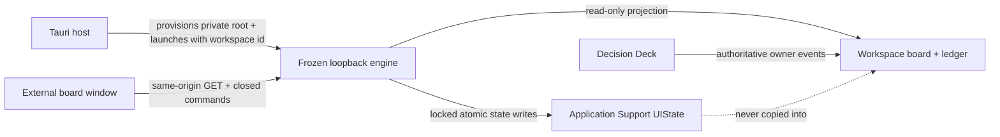

# HFLedger redesign v2 — local triage state and privacy contract

Status: Wave 1 design contract

Current implementation note (2026-07-21): the private document is now schema
version 2. Version 2 adds bounded per-item priority/work-type annotations and
the `set-item-metadata` / `clear-item-metadata` commands while preserving every
no-authoritative-write invariant below. Existing version 1 documents migrate
atomically with a `before-v1-<utc>.json` recovery snapshot. See
[`item-metadata.md`](item-metadata.md) for the extension contract; the version
1 examples below remain the migration source format.

Base: `ca27e60a9bff1f15c4f553edae707df37c47b497`

Scope: local UI state only; no production implementation in this branch

> Synthesis note: [`contract.md`](contract.md) is normative for implementation.
> Its public/private boundary is unchanged, but the final state/API spelling
> uses projection `itemId` and `changeId` values directly instead of this
> draft's `itemKey` and `changeKey` names. It also locks the module API and the
> native-to-page command boundary.

## 1. Decision

HFLedger for Mac shall keep triage state in one closed, revisioned JSON document
per registered workspace under the app's private Application Support directory.
The native host provisions the directory and passes its path and the registered
workspace identity to the frozen loopback engine when it starts. The served
Today UI reads and changes that state through a narrow same-origin loopback API.

The board window remains an external loopback page with **no general Tauri IPC or
filesystem capability**. The engine may write only the app-private state root
explicitly supplied by the native host. It must never derive that root from an
HTTP request, `board.json`, `config.json`, or a conventional home-directory
location.

This is intentionally not another task store:

- `board.json` remains authoritative coordination state.
- `ledger.jsonl` remains the append-only event and owner-outcome plane.
- the Decision Deck remains the only HFLedger surface that answers or snoozes an
  authoritative decision;
- local state only remembers how this installation presents and triages a read
  projection;
- deleting all local state changes no task, decision, evidence claim, or
  collector result.

The architecture is:



### Security invariants

1. No local-state operation may write a workspace file, append an event, move an
   authoritative cursor, or invoke a collector.
2. `ui.readOnly: true` forbids authoritative mutation but does **not** forbid
   app-private triage changes.
3. HTTP callers choose only an allowlisted context and closed command. They never
   supply a filesystem path or workspace namespace.
4. A state path is accepted only beneath the native-provisioned root, and no
   path component, state file, lock, recovery directory, or temporary file may
   be a symlink.
5. An acknowledgement or snooze applies to one exact attention generation. New
   material evidence receives a new `attentionKey` and resurfaces the item.
6. State contains stable identifiers and user-entered triage preferences, never
   copied titles, evidence prose, file contents, source URLs, copied agent
   context, credentials, or authoritative records.
7. Browser-only use is honestly session-only. `localStorage` is never represented
   as durable Mac app state.

## 2. Why the storage boundary lives behind the loopback engine

The current native board uses `WebviewUrl::External` to open the canonical HTML
served by the Python engine. Its Tauri capability grants `core:default` only to
the launcher window, and the native README explicitly promises that the board
has no Tauri IPC authority. Granting the external board window native commands
would enlarge a well-defined boundary and produce two UI implementations.

The loopback engine is already the board page's same-origin API and applies host,
framing, CSP, content-type, and body-size controls. A small local-state backend
therefore adds less authority than either giving the board Tauri IPC or creating
a second native bridge. The native host remains responsible for selecting and
protecting the storage root; the engine owns validation and the atomic
read-modify-write transaction.

No bearer token is required in v1. The reference server already assumes the
local operating-system account is trusted, binds only to loopback, has no CORS
opt-in, and requires JSON for writes. Another process running as the same user
could already read or change private HFLedger files. Local state grants no new
authoritative power. This decision must be revisited before any remote listener,
Android bridge, or less-trusted local plugin is introduced.

## 3. Exact on-disk layout

The native host must obtain its data directory from Tauri's `app_data_dir()`;
documentation may show the usual macOS expansion, but implementation must not
construct the path from `$HOME`:

```text
~/Library/Application Support/com.hfledger.desktop/
└── UIState/                                      mode 0700
    └── Workspaces/                               mode 0700
        └── <workspace-state-key>/                mode 0700
            ├── state.json                       mode 0600
            ├── state.lock                       mode 0600
            └── Recovery/                        mode 0700
                ├── corrupt-<utc>-<digest8>.json mode 0600
                └── before-v<N>-<utc>.json       mode 0600
```

`workspace-state-key` is not a raw workspace id or path. It is:

```text
lowerhex(SHA-256(UTF8("hfledger-ui-state-v1\0" + persisted_workspace_id)))
```

It is always 64 lowercase hexadecimal characters. Domain separation prevents a
digest used elsewhere from being mistaken for this namespace. The complete
persisted workspace id is recorded inside `state.json` and must match before a
state document is used.

The Tauri host launches the engine with both of these arguments:

```text
ledger --home <workspace> serve \
  --local-state-root <app-data>/UIState \
  --local-state-workspace-id <persisted Workspace.id> \
  --port <dynamic port>
```

Both local-state arguments are required together. A partial pair is a startup
error. The public engine remains platform-neutral: it never assumes the macOS
path and never creates it unless an explicit trusted launcher supplies it.

### Permissions

- `UIState`, `Workspaces`, each workspace directory, and `Recovery` are mode
  `0700`.
- `state.json`, `state.lock`, recovery files, and temporary files are mode
  `0600`.
- On every startup and before every write, the backend verifies the object type,
  rejects symlinks, and narrows an app-owned object's permissions if necessary.
- If permissions cannot be narrowed, state is unavailable. The engine must not
  continue writing a broadly readable file.
- The process umask is not a sufficient control; creation mode and an explicit
  permission check are both required.

## 4. Identity contract

### 4.1 Workspace and context identity

The logical workspace identity is the `Workspace.id` already persisted in the
native app's closed `app.json` registration. It is read from native settings,
not recomputed at launch and not accepted from the board page. Existing ids such
as `demo` and `workspace-<hex>` remain valid. Future native code must cap ids at
160 Unicode scalar values, reject control characters, and preserve an id for the
life of a registration.

The on-disk digest prevents even a malformed legacy id from becoming a path.
Moving a registered workspace must update its stored path without changing its
id. Removing a registration does not delete or rewrite its state directory. If
the same folder is later registered as a new identity, v1 treats it as new local
state; automatic identity guessing from project names or board contents is
forbidden. A later explicit relink feature may recover detached state after
showing both identities to the user.

A workspace can expose several allowlisted server contexts. State for those
contexts lives in the same document and is keyed by the exact validated
`ui.contexts[].id`. An HTTP request may select only one of those existing ids.
It cannot create a context or choose another workspace file.

### 4.2 Projection identities

The projection/server implementation must supply these opaque, stable fields:

| Field | Meaning | Required behavior |
|---|---|---|
| `itemKey` | One logical task, ask, run concern, or library item within a context | Stable across projection refreshes and title/status changes; never derived by fuzzy title matching |
| `attentionKey` | One material reason that an item currently needs triage | Changes when reason, cost-of-ignoring class, dispute state, or material evidence changes |
| `changeKey` | One change-journal entry | Stable and unique within the context; replaying the same upstream fact produces the same key |
| `viewCursor` | Opaque read-through marker for a top-level view | Monotonic only under the projection version that issued it; never a wall-clock timestamp chosen by the client |
| `projectKey` | One project filter | Stable, bounded, and optional |

The local-state layer treats these as opaque text. It validates bounds and
control characters but does not parse source-specific semantics. Item ids are
always scoped by workspace state file plus context id; identical task ids in two
contexts cannot collide.

An `attentionKey` must not be just `itemKey`. A deterministic implementation may
hash a canonical tuple such as projection version, item key, primary lane,
reason code, and evidence/source revision. It must exclude display wording so a
copy edit alone does not wake an item.

## 5. Closed schema, version 1

`state.json` is UTF-8 JSON with a trailing newline. The top level and every
nested record reject unknown fields. Maps with arbitrary caller-controlled keys
are avoided; dynamic collections are arrays with uniqueness checks and
deterministic serialization order.

```json
{
  "schemaVersion": 1,
  "workspaceId": "workspace-0123456789abcdef",
  "revision": 12,
  "createdAt": "2026-07-18T19:00:00Z",
  "updatedAt": "2026-07-18T21:04:03Z",
  "contexts": [
    {
      "contextId": "main",
      "lastSuccessfulVisitAt": "2026-07-18T21:03:58Z",
      "viewCursors": [
        {"view": "today", "cursor": "orientation-v2:184", "seenAt": "2026-07-18T21:03:58Z"},
        {"view": "changes", "cursor": "orientation-v2:184", "seenAt": "2026-07-18T21:03:58Z"},
        {"view": "all-work", "cursor": null, "seenAt": null},
        {"view": "shipped-log", "cursor": null, "seenAt": null},
        {"view": "watched", "cursor": null, "seenAt": null}
      ],
      "seenChanges": [
        {"changeKey": "change:run-184:task-7", "seenAt": "2026-07-18T21:03:58Z"}
      ],
      "attention": [
        {
          "itemKey": "task:fictional:oven-display",
          "attentionKey": "attention:9d7d2c1a",
          "state": "snoozed",
          "changedAt": "2026-07-18T21:04:03Z",
          "snoozedUntil": "2026-07-19T16:00:00Z",
          "localNote": "Recheck after the fictional review window."
        }
      ],
      "watched": [
        {"itemKey": "task:fictional:proofing-timer", "watchedAt": "2026-07-18T20:00:00Z"}
      ],
      "navigation": {
        "selectedView": "today",
        "selectedProjectKey": null,
        "selectedItemKey": "task:fictional:oven-display"
      },
      "layout": {
        "sidebarWidth": 220,
        "inspectorWidth": 360,
        "disclosures": [
          {"key": "inspector.runtime", "expanded": false},
          {"key": "inspector.evidence", "expanded": true}
        ]
      }
    }
  ]
}
```

### 5.1 Field rules

| Field | Contract |
|---|---|
| `schemaVersion` | Integer `1` exactly |
| `workspaceId` | Exact native registration id; 1–160 scalars; no control characters |
| `revision` | Integer `0..9_007_199_254_740_991`; incremented once per successful state transaction |
| timestamps | UTC RFC 3339 with seconds and literal `Z`; generated by the backend except snooze input, which is normalized by it |
| `contexts` | At most 32; unique allowlisted `contextId`; stale contexts may be retained but are not returned as active |
| `viewCursors` | Exactly one record for each of `today`, `changes`, `all-work`, `shipped-log`, and `watched` |
| `cursor` | Null or 1–256 scalars, no controls; opaque to storage |
| `seenChanges` | At most 1,000 unique `changeKey` records; `changeKey` is 1–240 scalars, no controls |
| `attention` | At most 500 records; unique `itemKey`; keys are 1–240 scalars, no controls |
| `attention.state` | `acknowledged` or `snoozed` |
| acknowledged record | `snoozedUntil` and `localNote` must both be null |
| snoozed record | `snoozedUntil` is required and after `changedAt`; `localNote` is optional |
| `localNote` | Null or 1–280 scalars and at most 1,024 UTF-8 bytes; one line; no control characters; explicitly entered by the user only |
| `watched` | At most 500 unique item keys; no title or item snapshot is stored |
| `selectedView` | `today`, `changes`, `all-work`, `shipped-log`, `watched`, or `project` |
| `selectedProjectKey` | Required only for `project`; otherwise null; at most 160 scalars |
| `selectedItemKey` | Null or a bounded opaque item key; a missing current item is harmless |
| pane widths | Finite whole CSS pixels; sidebar `180..360`, inspector `280..720` |
| `disclosures` | At most 32 unique contract-defined keys; no arbitrary item/source ids; booleans only |

The complete file, including the trailing newline, must not exceed 512 KiB. A
request body for the local-state command endpoint must not exceed 32 KiB even
though authoritative server bodies retain their existing 1 MiB ceiling.

### 5.2 Version and migration rules

- A missing file creates a validated v1 default with revision `0`.
- A known older version is migrated by a pure, deterministic, sequential
  function while holding the state lock.
- Before replacing a migrated file, preserve the original as
  `Recovery/before-v<N>-<utc>.json`, validate the migrated result, then use the
  normal atomic replace protocol.
- Migration snapshots are capped at the two newest per workspace.
- A migration is idempotent and never reads the authoritative board for values
  that were not already represented as stable ids.
- A version newer than the running engine is **not corruption**. The backend
  becomes unavailable with reason `newer-version`, leaves the file byte
  identical, and shows a local-state warning. Downgrade must never erase future
  fields.
- Unknown fields in the current version are invalid. They are handled as
  corruption, not silently dropped.

## 6. State semantics

### 6.1 Seen and unseen changes

The projection declares a stable `changeKey` and the current `viewCursor`.
Unseen is derived; it is not written back into any item:

1. A change is seen when its key is in `seenChanges`, or the projection proves it
   is at or before a compatible stored view cursor.
2. A change is unseen otherwise.
3. The UI may mark a bounded list of exact change keys seen. It may also advance
   a view cursor only to a cursor returned by the currently loaded projection.
4. Advancing a cursor never uses the client clock and never guesses from an item
   timestamp.
5. Once a stored cursor subsumes an individual seen key, the next successful
   write prunes that redundant key.
6. A projection-version mismatch makes the cursor incompatible. Exact
   `seenChanges` still apply, but the badge is coverage-qualified until the user
   successfully visits the new projection and stores its cursor.

V1 does not provide “mark unread.” That is not required for the check-in loop
and would require retaining exceptions indefinitely. It may be added in a later
schema version if dogfood demonstrates a need.

`lastSuccessfulVisitAt` advances only after all of the following are true:

- the selected context projection loaded and validated;
- the relevant view completed rendering without an error state;
- the app window was active and the view visible;
- the client submitted the exact projection cursor; and
- the local-state transaction committed successfully.

A GET, loading skeleton, failed render, background refresh, or coverage failure
does not count as a successful visit. The timestamp is presentation history, not
an evidence freshness clock.

### 6.2 Acknowledged attention

Acknowledging an item stores `itemKey`, the exact current `attentionKey`, state
`acknowledged`, and backend timestamp. It hides or de-emphasizes that attention
generation according to the interaction contract; it does not change the
item's primary lane or authoritative status.

If the same item later has a different `attentionKey`, the old acknowledgement
does not apply. The item resurfaces immediately. The stale record may be pruned
on the next successful write.

### 6.3 Snoozed attention

Local triage snooze means “hide this exact attention reason in this installation
until an instant.” It is distinct in naming, route, storage, copy, and behavior
from authoritative `decision_snoozed`:

- it never appends an `owner-ui` event;
- it never writes `snoozedUntil` or `snoozeReason` to a board item;
- it never removes a card from the Decision Deck;
- it expires at an RFC 3339 instant, not merely a date; and
- a changed `attentionKey` breaks the snooze early.

The maximum snooze is 30 days from the server's current time. Past instants and
larger windows are rejected. An expired record is ignored immediately and
pruned on the next successful transaction. A local note is never copied from an
item and is not a reason or instruction to an agent.

### 6.4 Watched items

Watch is an installation-local boolean keyed only by `itemKey`. It survives item
status and attention changes until explicitly removed. If the item is absent
from the current projection, the Watched view shows a bounded “not in current
projection” placeholder without storing title or old evidence. Watched records
are not silently evicted; when the 500-item cap is reached, a new watch is
rejected with a clear limit error until the user unwatches something.

### 6.5 Navigation, selection, pane widths, and disclosure

Navigation and layout are convenience state, never proof that an item exists.
On restore:

- an unknown selected view falls back to Today through schema migration;
- a missing project falls back to Today;
- a missing selected item clears selection in memory and may be repaired on the
  next preference write;
- stored widths are clamped before layout and rewritten only on the next user
  change;
- unknown disclosure keys are a schema error, while a newly added known key uses
  the UI default;
- high-frequency pane dragging is debounced, with at most one durable write per
  500 ms and a final write on drag end.

Window position and size remain owned by the existing Tauri window-state plugin.
They are not duplicated here.

## 7. Loopback API and authority separation

### 7.1 Capability advertisement

`GET /api/board` adds this shell field without exposing a path:

```json
{
  "ui": {
    "readOnly": true,
    "localState": {
      "mode": "durable",
      "available": true,
      "schemaVersion": 1
    }
  }
}
```

`mode` is `durable` for a valid native-provisioned backend, `session` for a
browser-only in-memory backend, or `unavailable`. An unavailable response may
include one closed reason code: `permissions`, `symlink`, `corrupt-unrecovered`,
`newer-version`, `lock`, or `io`. It must not include a path or raw exception.

`GET /api/local-state?context=<allowlisted-id>` returns the selected context's
validated state, current revision, and the same capability object. Responses use
`Cache-Control: no-store` and the existing security headers.

### 7.2 Closed command endpoint

All changes use:

```text
POST /api/local-state/command
Content-Type: application/json
```

The envelope is exact:

```json
{
  "schemaVersion": 1,
  "context": "main",
  "expectedRevision": 12,
  "command": "set-watch",
  "arguments": {
    "itemKey": "task:fictional:proofing-timer",
    "watched": true
  }
}
```

Unknown envelope fields, commands, or command arguments are rejected. The
supported commands are:

| Command | Arguments | Effect |
|---|---|---|
| `record-successful-visit` | `view`, `cursor`, `seenChangeKeys` (max 200) | Advances last successful visit, the named view cursor, and exact seen keys |
| `mark-changes-seen` | `changeKeys` (1–200) | Adds exact stable change keys without advancing a cursor |
| `acknowledge-attention` | `itemKey`, `attentionKey` | Stores an acknowledgement for the exact generation |
| `snooze-attention` | `itemKey`, `attentionKey`, `snoozedUntil`, optional `localNote` | Stores a bounded local snooze |
| `clear-attention-triage` | `itemKey` | Removes local acknowledgement/snooze only |
| `set-watch` | `itemKey`, `watched` boolean | Adds or removes the watch record idempotently |
| `set-navigation` | `selectedView`, optional `selectedProjectKey`, optional `selectedItemKey` | Replaces navigation selection |
| `set-pane-widths` | `sidebarWidth`, `inspectorWidth` | Replaces clamped widths |
| `set-disclosure` | `key`, `expanded` boolean | Replaces one allowlisted disclosure value |

Every command is an absolute set operation, not a toggle. `expectedRevision`
must equal the durable revision. A mismatch returns `409` with the current
revision and no state write. The client refetches, reapplies the user's intent,
and retries once; it never overwrites a newer document wholesale.

A success returns the new revision and the affected validated context state.
No response echoes a local note unless it is part of the authenticated same-user
state read already requested; error logs never include bodies.

### 7.3 Read-only routing

The current server rejects every POST before route execution when
`runtime.read_only` is true. V2 must separate route classes:

```text
authoritative POST route -> apply ui.readOnly guard -> existing writer path
local-state POST route   -> apply local-state capability guard -> private store
unknown POST route       -> 404
```

Local-state routes must not be inserted into the existing authoritative
`POST_ROUTES` registry or receive a `Context.store`. Their handlers receive only
the local backend, context id, and validated command. Server integration tests
must prove that every local command leaves `board.json` and `ledger.jsonl`
byte-identical in both writable and read-only workspaces.

The Decision Deck continues to use the authoritative routes and remains blocked
by `ui.readOnly`. No local command may accept `resolution`, `selectedOption`,
`completion`, `done`, reorder ids, source paths, evidence objects, or an event
action.

## 8. Filesystem transaction protocol

### 8.1 Path containment and symlinks

At native startup:

1. Resolve Tauri's app data directory through the platform API.
2. Create or inspect `UIState`, `Workspaces`, the digest-named workspace
   directory, and `Recovery` one component at a time.
3. Use `lstat`/`symlink_metadata`; reject any symlink, non-directory directory
   component, or non-regular file.
4. Canonicalize the existing app data root and final parent, then confirm the
   parent remains beneath the canonical root.
5. Pass the already-resolved root and logical workspace id to the engine.

The engine repeats containment checks before opening the lock and before atomic
replace. It derives the digest directory internally. HTTP values are never
joined to paths. On platforms that expose `O_NOFOLLOW` and directory-relative
open operations, the implementation must use them for lock, state, temporary,
and recovery files. A symlink race or unsupported object type fails the state
operation without unlinking or following the object.

### 8.2 Locking and atomic replace

One state transaction is:

1. Take the engine's per-state in-process reentrant lock.
2. Open `state.lock` as a regular mode-0600 file without following symlinks.
3. Take an exclusive POSIX `flock`.
4. Read at most 512 KiB from `state.json`; reject a larger file before decoding.
5. Validate schema, workspace id, context, and revision.
6. Validate the closed command and apply it to a deep copy.
7. Prune only records made redundant or expired under the deterministic rules.
8. Increment revision, set backend timestamps, deterministically sort arrays,
   encode UTF-8 JSON, and revalidate size and schema.
9. Create a same-directory unpredictable temporary file with exclusive create
   and mode `0600`.
10. Write all bytes plus newline, `fsync` the file, verify mode/type, replace
    `state.json` atomically, then `fsync` the parent directory.
11. Release `flock` and the process lock.

An exception before replace leaves the original state byte-identical. A
temporary file is removed best-effort. A crash after replace but before the
directory sync may expose either complete version after power loss, never a
partially written JSON file on a conforming local filesystem.

The native app is single-instance, but `flock` is still required because a
second engine or a command-line reference server may point at the same explicit
state root. Native Windows durable state is out of scope until HFLedger defines a
supported cross-process lock there.

### 8.3 Corruption recovery

Malformed UTF-8, invalid JSON, a current-version schema violation, a workspace
id mismatch, duplicate identities, or an over-limit file is corrupt state. It
never affects authoritative data.

While holding the lock, the backend:

1. Computes a short digest of the unreadable bytes without logging them.
2. Moves the complete file to
   `Recovery/corrupt-<utc>-<digest8>.json` without following symlinks.
3. Sets the recovery file to mode `0600` and syncs the recovery and workspace
   directories.
4. Creates a fresh default state only if preservation succeeded.
5. Returns a closed `recovered` warning so the UI can explain that local triage
   preferences reset; it does not show file contents.

Keep the three newest corruption files and two newest migration snapshots.
Pruning applies only to files matching the exact backend-owned pattern and only
after a new recovery/migration commit succeeds. If preservation, permission
repair, or locking fails, do not replace the bad file. Use an in-memory default
for that process, report `mode: unavailable`, and disable local writes.

A future schema version follows the fail-closed migration rule instead and is
never quarantined as corruption.

### 8.4 Bounded retention

- `seenChanges`: remove records subsumed by a compatible cursor; otherwise keep
  the 1,000 most recently seen and expose a coverage-qualified warning if older
  exact keys must be dropped.
- `attention`: remove expired snoozes after 30 days, and stale attention keys
  after the current projection has omitted them for 90 days. The omission clock
  is maintained in memory from successful observations; v1 does not persist
  item prose or a second task catalog merely to prune.
- `watched`: never automatic age-prune; enforce the hard cap.
- inactive contexts: retain state while the context remains in config. If it is
  removed, keep it for 180 days from its last successful visit, then remove it
  on a later write. A context with watched items is retained until explicit
  cleanup in a future UI.
- recovery files use the caps above.

Retention must not manufacture an authoritative completion, acknowledgement,
or “nothing needs you” claim. If exact seen history is truncated, the safe
result is more unseen changes, not fewer.

## 9. Browser-only reference server

When `ledger serve` starts without both native local-state arguments, it creates
one in-memory backend for the server process:

- the API and command schema remain identical;
- `ui.localState.mode` is `session`;
- state survives refreshes and navigation on that process and port;
- it disappears on process restart;
- the UI labels triage actions “This session only” and never claims a last visit
  from a previous run;
- `localStorage`, IndexedDB, cookies, and conventional Application Support paths
  are not read or written by the server;
- a page reload may use in-memory server state, but a new server is first-run.

This keeps the public demo useful without inventing a second persistence
contract. An explicit portable browser-state file or import/export format is
deferred and would require a separate privacy and identity design.

## 10. Backup, removal, reinstall, and upgrade behavior

### Workspace backups

The existing native “Create Backup” operation copies `config.json`,
`board.json`, `ledger.jsonl`, and workspace data directories into the native
Backups area. It must **not** include UIState. A workspace backup must be a valid
authoritative workspace, not a package that silently carries one installation's
seen, snoozed, watched, selected, or noted preferences.

The board store's pre-mutation backups likewise remain board-only. UI state has
its own bounded recovery copies solely for corruption and migrations.

### Workspace removal

Removing a workspace from the launcher unregisters it, stops its engine if
needed, and leaves both workspace data and its UIState directory untouched. V1
does not expose destructive UI-state cleanup. A future “Forget local triage
state” command must name the exact detached workspace and require confirmation.

### Reinstall

Replacing or upgrading `HFLedger.app` normally preserves Application Support,
so UI state remains. Deleting the Application Support directory, using a fresh
macOS account, or uninstalling with data removal resets triage state. That loss
is acceptable because no authoritative fact is stored there. There is no cloud
recovery or account sync.

### Upgrade and downgrade

Upgrades run the sequential migration protocol before serving local state.
The app bundle never contains state files or machine-specific paths. Downgrades
encountering a newer schema disable local state without changing it. Release
verification must continue rejecting embedded home paths and private state.

## 11. Privacy contract

The state file may contain only:

- opaque workspace, context, item, attention, change, and project identifiers;
- backend timestamps and opaque projection cursors;
- booleans, pane widths, view enums, and disclosure keys; and
- a short note explicitly typed into the local snooze control.

It must not contain:

- item titles, summaries, reason lines, evidence claims, evidence references, or
  provenance rows;
- file contents, relative or absolute file paths, repository slugs, source URLs,
  copied “context for agent,” or raw collector output;
- credentials, private keys, tokens, cookies, environment variables, or command
  lines;
- a serialized projection, board fragment, ledger entry, decision package, or
  diagnostic exception; or
- hidden analytics, telemetry identifiers, or a cloud account id.

The snooze form never prepopulates its note from source content and labels it
“Local note — do not paste secrets.” The backend rejects multiline/control text
and obvious private-key or common credential-prefix patterns as defense in
depth; this is not represented as a complete secret scanner. Notes are excluded
from logs, notifications, command palettes, crash reports, diagnostics, and
release artifacts.

Diagnostics may report only local-state mode, availability, schema version,
revision, byte size, record counts, permission health, and a closed error code.
They must not report ids, cursors, notes, paths below the already disclosed app
data root, or recovery contents.

## 12. Failure semantics

| Failure | User-visible behavior | Durable result | Authoritative result |
|---|---|---|---|
| no native backend | “This session only” | in-memory state | none |
| stale `expectedRevision` | refresh/retry prompt; HTTP 409 | no write | none |
| invalid command or bounds | inline validation error; HTTP 400 | no write | none |
| read-only observer | local command works; authoritative controls remain disabled | private state only | board/ledger byte-identical |
| symlink or containment failure | local state unavailable; closed warning | no path followed or removed | none |
| broad permissions cannot be narrowed | local state unavailable | no write | none |
| lock unavailable/busy | keep current UI state, retry with bounded backoff | no lost update | none |
| atomic stage/replace failure | show preference-save failure | old state byte-identical | none |
| corrupt state, quarantine succeeds | reset local triage with recovery warning | corrupt bytes preserved, new v1 default | none |
| corrupt state, quarantine fails | session default, durable writes disabled | corrupt file untouched | none |
| newer schema | “Update HFLedger to use local triage state” | file untouched | none |
| cap reached | reject the new record or conservatively mark more changes unseen | existing state preserved | none |
| projection key disappears | clear selection in memory; retain watch placeholder | bounded local record | none |
| system clock moves backward | backend timestamps remain nondecreasing relative to stored `updatedAt`; snooze compares instants conservatively | no premature wake claim | none |

Local-state failure must never take down the read-only board. The projection
continues to render with a local-state warning unless the authoritative board
itself fails validation.

## 13. Required test matrix

| Layer | Case | Required assertion |
|---|---|---|
| Python unit | default v1 encode/decode | exact closed schema, deterministic order, trailing newline |
| Python unit | every unknown/missing/wrong-type field | rejected without write |
| Python unit | bounds and secret-pattern note checks | limits enforced; no request body in error/log |
| Python unit | workspace-state-key derivation | fixed vectors, domain separation, raw id never becomes a path |
| Python unit | item/context uniqueness | duplicates and controls rejected |
| Python unit | attention generation changes | old acknowledgement and snooze stop applying |
| Python unit | snooze expiry and 30-day cap | exact instant behavior; expired record pruned safely |
| Python unit | cursor compatibility | timestamp is never used as cursor; version mismatch yields more unseen, not fewer |
| Python unit | retention | caps deterministic; watched never silently evicted |
| Filesystem unit | modes | all dirs `0700`; state, lock, temp, and recovery files `0600` |
| Filesystem unit | symlink at every component | root, Workspaces, digest dir, state, lock, Recovery, and temp attacks fail closed |
| Filesystem unit | path traversal ids | workspace/context/item strings cannot escape root |
| Filesystem unit | atomic replace failure | original bytes identical; no leaked temp |
| Filesystem unit | two processes write | `flock` serializes; both nonconflicting commands survive after retry |
| Filesystem unit | corrupt JSON/current schema | recovery copy exact, cap enforced, fresh default valid |
| Filesystem unit | future version | byte-identical and unavailable; never quarantined |
| Filesystem unit | migration failure/success | failure preserves original; success preserves pre-migration copy and is idempotent |
| Server integration | durable GET and closed commands | no-store/security headers, exact context selection, revision response |
| Server integration | stale revision | HTTP 409; no state or authoritative write |
| Server integration | `ui.readOnly: true` | all local commands work; every authoritative POST is 403; board and ledger bytes identical |
| Server integration | local-state command smuggling | paths, decisions, evidence objects, unknown args, and oversized bodies rejected |
| Server integration | non-loopback Host/CORS/content type | existing request boundary remains intact for local routes |
| Server integration | browser-only mode | session label; refresh persists; server restart resets; no files/localStorage created |
| Rust/native unit | launch argument construction | root comes from `app_data_dir`; id from selected registration; no HTTP input |
| Rust/native unit | workspace removal | registration removed; workspace and state directory remain |
| Rust/native unit | workspace move | stored id preserved when path changes |
| Rust/native unit | permission/symlink preflight | launch fails local-state capability safely without granting board IPC |
| Native integration | dynamic-port restart | same seen/snooze/watch/navigation state after engine restart on a different port |
| Native integration | context switch | no state bleed between allowlisted contexts |
| Native integration | app upgrade/downgrade fixture | migration succeeds; future version remains untouched |
| Native integration | manual workspace backup | backup validates and contains no UIState |
| Native integration | release privacy scan | no state, local note, private path, or local-state launch value embedded in app/DMG |
| UI/DOM | durable/session/unavailable modes | honest labels and controls; board remains usable when state fails |
| UI/DOM | pane drag debounce | bounds and final value persist without write storm |
| UI/DOM | missing selected/watched item | safe fallback/placeholder; no stale prose cached |

The native dynamic-port test is a release gate, not an optional manual check. It
must start a fictional workspace, create representative state, record the first
port, restart the engine until a different port is used, and verify the same
revision and state with no `localStorage` dependency.

## 14. Rejected alternatives

### Browser `localStorage` or IndexedDB as the durable store

Rejected because storage is origin-scoped and the native host intentionally uses
dynamic loopback ports. It also fragments state across browsers and profiles,
has weaker recovery/permission semantics, and cannot provide the required
cross-restart identity contract. It may hold transient render caches only; v1
does not need one.

### Put triage fields in `board.json`, `ledger.jsonl`, or workspace `config.json`

Rejected because seen, snoozed, watched, selection, and pane widths are not
authoritative multi-agent facts. Adding them would violate read-only observer
semantics, pollute backups and sync, create write contention, and make UI state
masquerade as protocol state.

### Put all triage state in native `app.json`

Rejected because high-frequency layout/cursor writes would contend with and
increase the corruption blast radius of workspace registration, autostart,
notifications, and restore settings. A dedicated per-workspace file gives
bounded recovery and lifecycle semantics without creating a database.

### Grant the external board window general Tauri IPC/filesystem access

Rejected because it breaks the current security promise and capability layout.
The narrow same-origin API is easier to validate and keeps one canonical served
Today implementation.

### Fixed port, cookies, or URL-keyed state

Rejected because port availability and restart recovery already require dynamic
ports. Port and URL are transport details, not workspace identity.

### SQLite, an event log, or a second task database

Rejected as unnecessary for the bounded preference volume. One locked atomic
JSON document is inspectable, migration-friendly, and reuses proven HFLedger
patterns. Local commands do not need an audit ledger because they grant no
authority; corruption recovery is sufficient.

### Include local state in workspace backups or sync it remotely

Rejected because state is installation-private and may include a user note.
Backup inclusion would make a portable authoritative workspace carry hidden UI
preferences. Cloud or peer sync would require accounts, conflict resolution,
encryption, revocation, and a multi-writer protocol that are explicitly out of
scope.

## 15. Integration requirements

### Projection/data-contract agent

- Emit stable `itemKey`, `attentionKey`, `changeKey`, compatible opaque
  `viewCursor`, and optional `projectKey`.
- Define material changes that rotate `attentionKey`; display-copy changes alone
  must not.
- Provide deterministic cursor compatibility/version data and a way to determine
  whether an exact seen key is subsumed.
- Never require the local store to parse installation-private sections or fuzzy-match
  titles.

### Loopback server agent

- Add a standalone local-state module with closed validation, memory and file
  backends, locks, atomic replace, recovery, migrations, and size limits.
- Add the two native launch arguments and reject partial configuration.
- Add capability data, `GET /api/local-state`, and the single closed command
  endpoint.
- Split authoritative and local route guards so read-only permits only the
  latter.
- Preserve loopback binding, Host defense, no CORS, CSP, JSON-only writes, and
  static allowlisting.

### Native-host agent

- Provision Application Support directories with the specified modes and
  symlink checks.
- Pass only the selected persisted workspace id and the app-derived root to the
  engine; never expose either as editable page input.
- Preserve workspace ids across launch, upgrade, and path relocation.
- Keep the board window free of Tauri commands/capabilities.
- Leave UIState untouched on unregister and exclude it from workspace backup,
  diagnostics content, release bundles, and privacy manifests.

### Served-UI agent

- Hydrate from server state before deciding seen/snoozed/watched presentation.
- Use absolute set commands with optimistic revision handling; never send a
  whole replacement document.
- Distinguish “Snooze in Today” from Decision Deck snooze in copy and menus.
- Show durable, session-only, recovered, and unavailable state honestly.
- Never cache raw projection or note content in browser storage, logs, service
  worker, URL, or analytics.
- Treat a changed `attentionKey` as immediately active even if its item was
  previously acknowledged or snoozed.

### QA/release agent

- Implement every row in the test matrix with fictional data.
- Add byte-identity assertions around both board and ledger for all local
  commands.
- Make dynamic-port persistence, read-only route separation, symlink refusal,
  permissions, future-version preservation, and release privacy mandatory
  gates.

## 16. V1 acceptance criteria

The contract is satisfied only when:

1. seen, acknowledged, snoozed, watched, visit, cursor, navigation, selection,
   pane, and disclosure state survive a native restart on a different port;
2. the same operations in a browser-only server are clearly session-only and
   create no durable app state;
3. local commands work in a read-only observer while every authoritative route
   remains forbidden and authoritative bytes remain identical;
4. new material attention reliably breaks an old acknowledgement or snooze;
5. every state path is contained, private, non-symlinked, locked, atomically
   replaced, bounded, migratable, and recoverable;
6. a failure or downgrade never destroys the only recoverable state copy;
7. workspace removal and manual backups never delete or silently transport
   local state;
8. the file, API, logs, diagnostics, app bundle, and tests contain no copied
   evidence prose, file content, secret, private source path, or real installation data;
   and
9. no local-state code path can answer a decision, complete a task, append an
   event, change `board.json`, or change `ledger.jsonl`.

This is the smallest design that survives dynamic ports and app restarts while
preserving HFLedger's single authoritative data plane.
