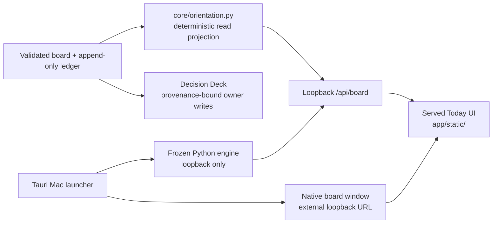

# HFLedger redesign v2 baseline preflight

Date: July 18, 2026

This preflight preserves the already-built HFLedger Today/evidence and native
Mac milestone before redesign-v2 contract work begins. It does not authorize
Wave 2 implementation, publish the repository, change a live installation writer, or
move `task-hfledger-redesign-v2` out of `Needs Spec`.

## Repository state

- Repository: the public HFLedger checkout containing this document. Its local
  absolute path is intentionally omitted from committed source.
- Inspection starting branch: `main`
- Inspection starting HEAD: `c6a5a1954affaa6efffed2abc821de79303a5196`
  (`v0.4.1`, `origin/main`)
- Starting remote relationship: `HEAD...origin/main` was `0 0`; the public
  remote had no unpublished commit from this checkout.
- Checkpoint branch: `integration/hfledger-redesign-v2-base`
- The checkpoint branch has no upstream and was not pushed. After this
  document and the milestone are committed, its tip is the canonical base.
  The exact immutable SHA is returned by Prompt 0 and can always be resolved
  locally with:

  ```sh
  git rev-parse --verify integration/hfledger-redesign-v2-base^{commit}
  ```

The initial dirty inventory contained 28 modified tracked files and 29 new
committable files.

### Modified tracked files

```text
CHANGELOG.md
README.md
app/server.py
app/static/app.css
app/static/app.js
app/static/deck.html
app/static/deck.js
app/static/index.html
cli/ledger
config.example.json
core/ledger.py
core/schema.py
core/store.py
docs/automation.md
docs/protocol.md
docs/release.md
docs/ui.md
example/config.json
install/ledger-install
packs/adapters/__init__.py
packs/render.py
packs/templates/AGENTS.md.tmpl
packs/templates/attend.md.tmpl
packs/templates/work.md.tmpl
scripts/release-check
tests/test_cli.py
tests/test_packs.py
tests/test_server.py
```

### New committable files

```text
.github/workflows/macos.yml
core/evidence.py
core/orientation.py
native/macos-host/.gitignore
native/macos-host/README.md
native/macos-host/package-lock.json
native/macos-host/package.json
native/macos-host/requirements-build.txt
native/macos-host/scripts/build_engine.py
native/macos-host/scripts/build_tauri.py
native/macos-host/scripts/sign_local.py
native/macos-host/scripts/stage_runtime.py
native/macos-host/scripts/verify_release.py
native/macos-host/src-tauri/Cargo.lock
native/macos-host/src-tauri/Cargo.toml
native/macos-host/src-tauri/build.rs
native/macos-host/src-tauri/capabilities/default.json
native/macos-host/src-tauri/icons/128x128.png
native/macos-host/src-tauri/icons/128x128@2x.png
native/macos-host/src-tauri/icons/32x32.png
native/macos-host/src-tauri/icons/icon.icns
native/macos-host/src-tauri/src/lib.rs
native/macos-host/src-tauri/src/main.rs
native/macos-host/src-tauri/tauri.conf.json
native/macos-host/src/icon.svg
native/macos-host/src/index.html
native/macos-host/src/main.js
native/macos-host/src/styles.css
tests/test_orientation.py
```

`docs/redesign-v2/preflight.md` is the only file added by Prompt 0.

## Architecture map



- **Core projection:** `core/orientation.py` derives version-1 shipped,
  moving, owner-needed, stalled, effectiveness, and coverage lanes from a
  validated board plus validated ledger entries. It is deterministic and does
  not create a second database.
- **Loopback API:** `app/server.py` loads the validated state, validates the
  ledger cursor, exposes the projection at `/api/board`, binds to loopback, and
  rejects every mutation when `ui.readOnly` is true.
- **Served Today UI:** `app/static/index.html`, `app.js`, and `app.css` render
  the current four-lane Today milestone and coverage notices. This is the
  interface redesign v2 will replace after its contracts are locked.
- **Decision Deck:** `app/static/deck.html` and `deck.js` remain the only
  owner-answering surface. In read-only observer mode they advertise the
  compatibility boundary and cannot write.
- **Tauri launcher:** `native/macos-host/` manages explicit workspaces,
  app-private settings, a frozen engine, dynamic loopback ports, lifecycle,
  backups, diagnostics, notifications, launch-at-login, and release tooling.
- **Native board window:** the Tauri host opens the canonical served HTML in a
  separate native window. That window receives no filesystem or Tauri IPC
  authority; task and decision behavior remains in the loopback engine.

## Coherent existing milestone

All reviewed changes belong to one already-built productization milestone:

1. `core/evidence.py`, the CLI/config/schema changes, protocol docs, pack
   adapters, and tests add a closed, bounded, audit-only evidence event surface
   for Codex, Claude Code, and other runtimes. These events do not move queue
   state or grant merge/deploy authority.
2. `core/orientation.py`, server changes, served UI changes, read-only mode,
   documentation, and tests add the version-1 Today/evidence orientation layer
   and make private observer workspaces non-authoritative.
3. `native/macos-host/`, the Mac workflow, release documentation, and README
   changes add the installed `0.6.0-alpha.4` Tauri host, pinned frozen engine,
   fictional demo, lifecycle/recovery features, ad-hoc build verification, and
   attended-only Developer ID/notarization draft-release scaffolding.
4. The changelog and release-check exclusions describe and test those same
   features. Dependency locks, icons, and the GitHub workflow are source or
   reproducibility inputs, not generated local outputs.

The milestone agrees with private board evidence for
`task-hfledger-orientation-v1`, `task-hfledger-private-observer-v1`,
`task-hfledger-native-today-integration`, and the completed Mac productization
children. No redesign-v2 production implementation is present in this base.

## Exclusions and privacy review

The following remain uncommitted and are intentionally excluded:

```text
native/macos-host/.build-venv/          pinned local build environment (~17 MB)
native/macos-host/.engine-build/        frozen-engine build output (~15 MB)
native/macos-host/node_modules/         installed JavaScript dependencies (~14 MB)
native/macos-host/src-tauri/gen/        generated Tauri schemas (~344 KB)
native/macos-host/src-tauri/runtime/    staged engine/demo runtime (~11 MB)
native/macos-host/src-tauri/target/     Rust/app/DMG build output (~7.2 GB)
/Applications/HFLedger.app              installed local dogfood app
~/Library/Application Support/com.hfledger.desktop/  private app state/workspaces
```

The private hub, observer projection, shadow-migration data, research
captures, and the external prompt packet are outside this public repository and
were not staged. The repository contains only the fictional Ovenlight example.

The complete tracked diff and every new source/configuration file were
reviewed. Scans found no private keys, credential values, installation content, owner/user
names, absolute user-home literals, or machine-specific source paths.
Secret-related matches are limited to GitHub Actions secret references,
release documentation warning against committed credentials, and an explicit
negative test for an unsupported evidence kind. `verify_release.py` also
rejects user-home and installation-specific markers in the built bundle.

## Checks and build evidence

| Check | Result |
|---|---|
| `python3 tests/run_all.py` | PASS — 139 tests |
| `./scripts/release-check --allow-dirty` | PASS — compile, JS syntax, 139 tests, board/config/cursor/provenance validation, and disposable demo swipe |
| `PATH=/opt/homebrew/opt/rustup/bin:$PATH cargo test --locked` | PASS — 3 Rust tests |
| `PATH=/opt/homebrew/opt/rustup/bin:$PATH cargo clippy --locked -- -D warnings` | PASS |
| `npm run verify` | PASS — existing `0.6.0-alpha.4` app is validly ad-hoc signed; engine `0.4.1`, arm64, containment/privacy scan, and manifest passed |
| `npm audit --audit-level=high` | PASS — 0 vulnerabilities |
| `git diff --check` | PASS |

The first bare `cargo` attempt failed only because this shell did not include
the Homebrew rustup shim. The documented absolute PATH invocation above passed.
The existing app bundle was verified rather than notarized. The release check
also reported that the optional external `LEDGER_PUBLISH_GATE` was not set;
that is not a blocker for this local, unpushed checkpoint and is still required
before any public release.

Toolchain observed: Python 3.9.6, Node 25.8.1, npm 11.11.0, Rust/Cargo 1.97.1.

## Safe base and future worktrees

The safe base is the commit containing this document at the tip of
`integration/hfledger-redesign-v2-base`. Because a Git commit cannot include
its own cryptographic SHA without changing that SHA, Prompt 0 returns the full
immutable `BASE_COMMIT` after creating it. Future work must resolve and pin the
branch tip before creating a worktree:

```sh
REPO_ROOT="$(git rev-parse --show-toplevel)"
WORKTREE_ROOT="$(dirname "$REPO_ROOT")/ledger-worktrees"
BASE_COMMIT="$(git -C "$REPO_ROOT" rev-parse --verify integration/hfledger-redesign-v2-base^{commit})"
test -n "$BASE_COMMIT"
mkdir -p "$WORKTREE_ROOT"
git -C "$REPO_ROOT" worktree add \
  -b design/redesign-v2-projection-contract \
  "$WORKTREE_ROOT/redesign-v2-projection-contract" \
  "$BASE_COMMIT"
```

Each other Wave-1 agent must substitute its own branch and worktree path while
using the same immutable `BASE_COMMIT`. No implementation agent may use this
shared checkout.

## Known risks and gates

- `task-hfledger-redesign-v2` is still `Needs Spec`. Prompt 0 preserves the
  base only. Wave 1 must lock the contracts and split/promote dedicated child
  tasks before any Wave 2 coding starts.
- The current orientation projection is version 1 and intentionally simpler
  than redesign v2. It does not yet provide the ranked Attention inbox,
  run-grouped change journal, two-clock provenance dossier, or durable local
  seen/snooze/watch state.
- The public repository must stay generic. Private installation sections and legacy
  decision compatibility remain in private adapters and cannot become public
  protocol assumptions or fixtures.
- Read-only observers may project validated state but every authoritative HTTP
  mutation is rejected with `403`; the native board window has no IPC write
  authority. Redesign work must preserve both properties.
- The native host stores workspace paths only in private app settings and
  diagnostics. Release verification must continue preventing those paths or
  private workspace data from entering a public artifact.
- Developer ID credentials, notarization, repository push, GitHub release
  creation, updater activation, authoritative installation cutover, second-Mac work,
  and Android work remain attended/protected gates and are outside this base.
